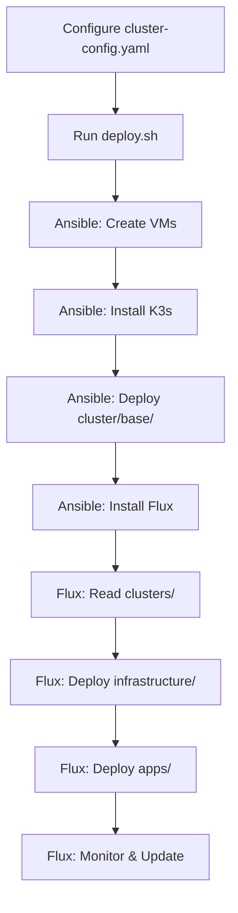

# InfraFlux Hybrid Ansible + Flux Architecture

## Overview

InfraFlux uses a **hybrid deployment approach** combining Ansible for infrastructure provisioning and Flux GitOps for application lifecycle management.

## Two-Phase Deployment

### Phase 1: Ansible Bootstrap (Infrastructure-First)
```
Ansible deploys:
├── Proxmox VMs
├── K3s cluster  
├── Core infrastructure (from cluster/base/)
├── Essential applications (from cluster/base/)
└── Flux installation
```

### Phase 2: Flux GitOps (Application-Focused)
```
Flux manages:
├── New applications (from apps/)
├── Infrastructure updates (from infrastructure/)
├── Configuration drift prevention
└── Continuous delivery
```

## Directory Structure Mapping

### Ansible-Managed (Bootstrap)
- **`cluster/base/`** → Deployed by Ansible during bootstrap
- **`cluster/overlays/`** → Environment-specific Ansible configurations
- **`playbooks/`** → Ansible deployment automation

### Flux-Managed (GitOps)
- **`apps/`** → New applications managed by Flux
- **`infrastructure/`** → Infrastructure updates managed by Flux  
- **`clusters/`** → Flux bootstrap configurations per environment

### Shared Resources
- **`config/`** → Cluster configuration used by both Ansible and Flux
- **`secrets/`** → Secret templates used by both systems

## Migration Strategy

Applications transition from Ansible to Flux management:

1. **New applications** → Added directly to `apps/`
2. **Existing applications** → Gradually migrated from `cluster/base/` to `apps/`
3. **Infrastructure** → Enhanced through `infrastructure/` while preserving `cluster/base/`

## Benefits

### Ansible Phase
- ✅ Reliable infrastructure provisioning
- ✅ Complex dependency handling
- ✅ Environment-specific configurations
- ✅ Imperative deployment for complex setups

### Flux Phase  
- ✅ GitOps workflow (pull-based)
- ✅ Automatic configuration drift correction
- ✅ Declarative application management
- ✅ Continuous delivery and updates

## Deployment Flow



This hybrid approach provides the **reliability of Ansible** for complex infrastructure provisioning while gaining the **agility of GitOps** for application management.