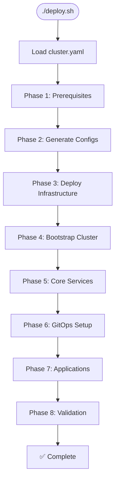

# InfraFlux v2.0 - System Architecture

> **Next-Generation Immutable Kubernetes Platform**
> Built on Talos Linux with GitOps Automation

---

## 🎯 **Architectural Overview**

InfraFlux v2.0 represents a complete architectural transformation from traditional mutable infrastructure to a modern, immutable, API-driven platform. The system is built on Talos Linux and orchestrated through GitOps principles, providing enterprise-grade security, reliability, and automation.

### **Core Architecture Principles**

1. **Immutable Infrastructure**: No configuration drift, everything replaced not modified
2. **API-Only Operations**: Zero SSH access, all management via secure APIs
3. **GitOps-First**: Git as single source of truth for all configurations
4. **Single Configuration Source**: Master config drives entire platform generation
5. **Zero-Trust Security**: Comprehensive security at every layer

---

## 🏗️ **System Components**

### **Infrastructure Layer**

```plaintext
┌─────────────────────────────────────────────────────────────┐
│                    Proxmox Infrastructure                    │
├─────────────────────────────────────────────────────────────┤
│  Control Plane VMs        │  Worker VMs                     │
│  ├─ CP-1 (Talos Linux)    │  ├─ Worker-1 (Talos Linux)     │
│  ├─ CP-2 (Talos Linux)    │  ├─ Worker-2 (Talos Linux)     │
│  └─ CP-3 (Talos Linux)    │  └─ Worker-N (Talos Linux)     │
└─────────────────────────────────────────────────────────────┘
```

**Characteristics:**

- **VM Provisioning**: Terraform automation
- **Operating System**: Talos Linux (immutable, Kubernetes-optimized)
- **Management**: API-only, no SSH access
- **Security**: Certificate-based authentication

### **Kubernetes Layer**

```plaintext
┌─────────────────────────────────────────────────────────────┐
│                   Kubernetes Cluster                        │
├─────────────────────────────────────────────────────────────┤
│  Control Plane             │  Data Plane                    │
│  ├─ etcd cluster (HA)      │  ├─ Container Runtime (CRI)    │
│  ├─ API Server             │  ├─ Kubelet                    │
│  ├─ Controller Manager     │  └─ Workload Pods              │
│  └─ Scheduler              │                                │
└─────────────────────────────────────────────────────────────┘
```

**Features:**

- **High Availability**: 3-node etcd cluster
- **Native Kubernetes**: No distribution overhead
- **Security**: Pod Security Standards enforced
- **Networking**: Cilium CNI with network policies

### **Platform Layer**

```plaintext
┌─────────────────────────────────────────────────────────────┐
│                   Platform Services                         │
├─────────────────────────────────────────────────────────────┤
│  Core Infrastructure      │  GitOps & Automation           │
│  ├─ Cilium (CNI/Security) │  ├─ Flux v2 (GitOps)          │
│  ├─ cert-manager (TLS)    │  ├─ Helm Controller            │
│  ├─ Sealed Secrets        │  └─ Kustomize Controller       │
│  └─ Network Policies      │                                │
└─────────────────────────────────────────────────────────────┘
```

**Services:**

- **Networking**: Cilium with eBPF-based networking and security
- **TLS Management**: Automated certificate lifecycle with cert-manager
- **Secret Management**: GitOps-safe secrets with Sealed Secrets
- **GitOps Engine**: Flux v2 for continuous delivery

### **Application Layer**

```plaintext
┌─────────────────────────────────────────────────────────────┐
│                   Application Stack                         │
├─────────────────────────────────────────────────────────────┤
│  Observability            │  Security & Productivity        │
│  ├─ Prometheus (Metrics)  │  ├─ Authentik (Auth)           │
│  ├─ Grafana (Dashboards) │  ├─ Nextcloud (Collaboration)   │
│  ├─ Loki (Logging)       │  └─ Security Policies          │
│  └─ Alertmanager         │                                │
└─────────────────────────────────────────────────────────────┘
```

**Applications:**

- **Monitoring**: Prometheus + Grafana + Loki stack
- **Authentication**: Authentik for SSO and identity management
- **Collaboration**: Nextcloud for productivity
- **Security**: Comprehensive security policies and monitoring

---

## 🔄 **Deployment Pipeline**

### **Phase-Based Deployment**



### **Configuration Flow**

```plaintext
cluster.yaml → Jinja2 Templates → Generated Configs
                                      ├─ Talos machine configs
                                      ├─ Terraform infrastructure
                                      ├─ Flux GitOps manifests
                                      └─ Application definitions
```

---

## 🔐 **Security Architecture**

### **Zero-Trust Model**

```plaintext
┌─────────────────────────────────────────────────────────────┐
│                   Security Layers                          │
├─────────────────────────────────────────────────────────────┤
│  Application Security     │  Platform Security             │
│  ├─ Pod Security Contexts │  ├─ Network Policies (Cilium)  │
│  ├─ RBAC Policies        │  ├─ TLS Everywhere             │
│  └─ Sealed Secrets       │  └─ Audit Logging             │
├─────────────────────────────────────────────────────────────┤
│  Infrastructure Security  │  Access Control                │
│  ├─ Immutable OS (Talos)  │  ├─ Certificate-based Auth     │
│  ├─ API-only Access      │  ├─ No SSH Access              │
│  └─ Encrypted etcd       │  └─ Least Privilege            │
└─────────────────────────────────────────────────────────────┘
```

### **Security Features**

- **No SSH Access**: All operations via authenticated APIs
- **Certificate PKI**: Automated certificate management
- **Network Microsegmentation**: Cilium network policies
- **Immutable Infrastructure**: Configuration drift impossible
- **Audit Logging**: Complete audit trail of all operations
- **Secret Encryption**: Sealed secrets for GitOps workflows

---

## 🗂️ **Repository Structure**

```plaintext
infraFlux/
├── 📋 config/
│   └── cluster.yaml          # Single source of truth
├── 📝 templates/                    # Jinja2 templates
│   ├── talos/                      # Talos machine configs
│   ├── terraform/                  # Infrastructure templates
│   ├── flux/                       # GitOps configurations
│   └── security/                   # Security policies
├── 🔧 playbooks/                   # Pure Ansible deployment
│   ├── generate-configs.py         # Config generator
│   ├── validate-config.sh         # Validation tools
│   └── test-*.sh                   # Testing scripts
├── 📚 docs/                        # All documentation
│   ├── plan/                       # Implementation plans
│   ├── ARCHITECTURE.md             # This document
│   └── DEPLOYMENT_FLOWCHART.md     # Process flowchart
├── 🔄 GitOps Structure/
│   ├── clusters/                   # Cluster definitions
│   ├── infrastructure/             # Core services
│   └── apps/                       # Applications
├── 🧪 tests/                       # Testing framework
└── 🚀 deploy.sh                    # Unified deployment
```

---

## 🌊 **GitOps Workflow**

### **Git Repository Structure**

```plaintext
Git Repository → Flux Controllers → Kubernetes Cluster
     ↓               ↓                    ↓
Configuration    Automated           Live State
  Changes       Deployment        Reconciliation
```

### **Flux Architecture**

```plaintext
┌─────────────────────────────────────────────────────────────┐
│                   Flux v2 Components                       │
├─────────────────────────────────────────────────────────────┤
│  Source Controller        │  Deployment Controllers        │
│  ├─ Git Repository        │  ├─ Kustomize Controller       │
│  ├─ Helm Repository       │  ├─ Helm Controller            │
│  └─ Image Registry        │  └─ Notification Controller    │
└─────────────────────────────────────────────────────────────┘
```

### **Continuous Deployment**

1. **Git Commit**: Changes pushed to Git repository
2. **Source Detection**: Flux detects changes in Git
3. **Manifest Generation**: Kustomize/Helm generates K8s manifests
4. **Cluster Apply**: Controllers apply changes to cluster
5. **Health Check**: System validates deployment health
6. **Drift Detection**: Continuous monitoring for configuration drift

---

## 🚀 **Operational Model**

### **Day 0: Initial Deployment**

```bash
# Complete platform deployment
ansible-playbook playbooks/main.yml --extra-vars config_file=config/cluster.yaml --extra-vars deployment_phase=all

# Phase-specific deployment
ansible-playbook playbooks/main.yml --extra-vars config_file=config/cluster.yaml --extra-vars deployment_phase=infrastructure
ansible-playbook playbooks/main.yml --extra-vars config_file=config/cluster.yaml --extra-vars deployment_phase=cluster
ansible-playbook playbooks/main.yml --extra-vars config_file=config/cluster.yaml --extra-vars deployment_phase=apps
```

### **Day 1: Application Management**

```bash
# All operations through Git commits
git add apps/new-application/
git commit -m "Add new application"
git push origin main

# Flux automatically deploys changes
flux reconcile source git infraflux
flux get all
```

### **Day 2: Operations & Maintenance**

- **No SSH Required**: All operations via APIs
- **Immutable Updates**: Replace nodes, don't modify
- **GitOps Driven**: All changes through Git workflows
- **Automated Healing**: Flux maintains desired state
- **Monitoring**: Prometheus/Grafana observability

---

## 📊 **Performance & Scale**

### **Resource Requirements**

| Component                | CPU      | Memory | Storage |
| ------------------------ | -------- | ------ | ------- |
| Control Plane (per node) | 2 cores  | 4GB    | 50GB    |
| Worker Node (per node)   | 4 cores  | 8GB    | 100GB   |
| Total Minimum            | 18 cores | 36GB   | 450GB   |

### **Scalability**

- **Horizontal**: Add worker nodes via configuration
- **Vertical**: Resize VMs through Proxmox
- **Applications**: Scale via Kubernetes HPA/VPA
- **Storage**: Distributed storage with Longhorn

### **Performance Optimizations**

- **BBR Congestion Control**: Optimized network performance
- **CPU Manager**: CPU pinning for critical workloads
- **Kernel Tuning**: Optimized sysctls for Kubernetes
- **NUMA Awareness**: NUMA-optimized scheduling

---

## 🔍 **Monitoring & Observability**

### **Metrics Collection**

```plaintext
Application Metrics → Prometheus → Grafana Dashboards
Infrastructure Metrics → Node Exporter → Alerting Rules
Kubernetes Metrics → kube-state-metrics → SLO Monitoring
```

### **Logging Pipeline**

```plaintext
Container Logs → Loki → Grafana Log Analysis
Audit Logs → Talos Audit → Security Monitoring
System Logs → Journal → Troubleshooting
```

### **Health Monitoring**

- **Cluster Health**: Node and pod status monitoring
- **Application Health**: Service-level health checks
- **Infrastructure Health**: Proxmox and storage monitoring
- **Security Health**: Compliance and policy monitoring

---

## 🛠️ **Maintenance & Updates**

### **Talos Updates**

```bash
# Immutable OS updates (replace, don't patch)
talosctl upgrade --image ghcr.io/siderolabs/talos:v1.8.0
talosctl health --wait
```

### **Kubernetes Updates**

```bash
# Kubernetes version updates via configuration
yq eval '.data.kubernetes_version = "v1.31.0"' -i config/cluster.yaml
ansible-playbook playbooks/main.yml --extra-vars config_file=config/cluster.yaml --extra-vars deployment_phase=cluster
```

### **Application Updates**

```bash
# All application updates via GitOps
git add apps/monitoring/prometheus/values.yaml
git commit -m "Update Prometheus to v2.50.0"
git push origin main
```

---

## 🎯 **Benefits**

### **For Operations Teams**

- ✅ **Zero SSH Access**: Eliminates SSH key management and security risks
- ✅ **Immutable Infrastructure**: No configuration drift or "snowflake" servers
- ✅ **One-Command Deployment**: Complete platform in < 15 minutes
- ✅ **GitOps Automation**: All changes tracked and auditable
- ✅ **Automatic Rollback**: Failed deployments automatically reverted

### **For Development Teams**

- ✅ **Consistent Environments**: Identical dev/staging/production
- ✅ **Self-Service**: Applications deployed via Git workflows
- ✅ **Observable by Default**: Comprehensive monitoring and logging
- ✅ **Security by Design**: Built-in security policies and controls
- ✅ **Cloud-Native Ready**: Modern Kubernetes-native platform

### **For Security Teams**

- ✅ **Zero-Trust Architecture**: No implicit trust relationships
- ✅ **Audit Everything**: Complete audit trail of all operations
- ✅ **Immutable Infrastructure**: Attack surface minimization
- ✅ **Policy Enforcement**: Automated security policy compliance
- ✅ **Certificate Management**: Automated PKI and TLS everywhere

---

## 📚 **Additional Documentation**

For detailed implementation information, see:

- **[Deployment Flowchart](DEPLOYMENT_FLOWCHART.md)**: Complete deployment process
- **[Talos Architecture Plan](plan/TALOS_ARCHITECTURE.md)**: Talos implementation details
- **[GitOps Workflow Plan](plan/GITOPS_WORKFLOW.md)**: Flux GitOps architecture
- **[Deployment System Plan](plan/DEPLOYMENT_SYSTEM.md)**: Automation pipeline design
- **[Configuration Management Plan](plan/CONFIGURATION_MANAGEMENT.md)**: Config system design
- **[Security Framework Plan](plan/SECURITY_FRAMEWORK.md)**: Security architecture
- **[Completion Status](plan/INFRAFLUX_V2_COMPLETION_STATUS.md)**: Production readiness

---
