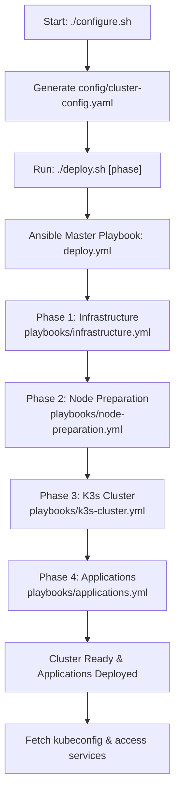

# Deployment Flowchart

## Detailed Steps

## Key Features & Flow

### 🔐 Authentication Flow

- **Proxmox**: Username/Password via API (no SSH needed)
- **VMs**: SSH key-based authentication (deployed during VM creation)
- **Secure**: Password auth disabled on VMs after deployment

### 🌐 Network Intelligence

- **Auto-Detection**: Discovers local network configuration
- **Flexible**: Supports any private IP range (192.168.x.x, 10.x.x.x, 172.x.x.x)
- **Sequential IPs**: Assigns IPs starting from .10 (Controllers first, then Workers)

### 🔄 Phase-Based Deployment

1. **Infrastructure**: Proxmox VM creation with Terraform templates
2. **Node Prep**: System hardening and Kubernetes prerequisites
3. **K3s Setup**: HA cluster with embedded etcd
4. **Applications**: Core services using native K3s features

### 🚀 Native K3s Advantages

- **Traefik**: Built-in ingress controller (enabled instead of NGINX)
- **ServiceLB**: Native load balancer for small clusters
- **Local Storage**: Built-in storage class
- **Lightweight**: Single binary, minimal resource usage

### 🛠️ Error Handling

- **Validation**: Pre-flight checks for all dependencies
- **Rollback**: Phase-based deployment allows partial recovery
- **Logging**: Detailed logs for each phase
- **Health Checks**: Continuous monitoring during deployment
