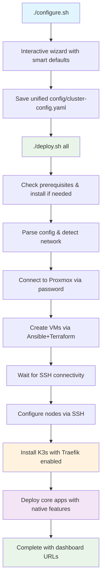

# InfraFlux Deployment Flow Chart

## Current Deployment Process Overview

```mermaid
flowchart TD
    A[User runs ./configure.sh] --> B{Config exists?}
    B -->|No| C[Interactive Configuration Wizard]
    B -->|Yes| D[Load existing config/cluster-config.yaml]

    C --> E[Auto-detect network settings]
    E --> F[Collect user inputs:<br/>- Cluster name<br/>- Proxmox details<br/>- Node counts<br/>- VM specs]
    F --> G[Save config/cluster-config.yaml]
    D --> G

    G --> H[User runs ./deploy.sh]
    H --> I[Check prerequisites:<br/>- ansible<br/>- yq<br/>- kubectl]
    I --> J{All tools present?}
    J -->|No| K[Auto-install missing tools]
    J -->|Yes| L[Parse configuration]
    K --> L

    L --> M[Create work directory & vars]
    M --> N{Which phase?}

    N -->|all/infrastructure| O[Phase 1: Infrastructure]
    N -->|all/k3s| P[Phase 2: K3s Setup]
    N -->|all/apps| Q[Phase 3: Applications]

    O --> O1[Connect to Proxmox via password]
    O1 --> O2[Create Controller VMs<br/>- Auto-assign IPs<br/>- Clone from template<br/>- Configure SSH keys]
    O2 --> O3[Create Worker VMs<br/>- Sequential IP assignment<br/>- Same configuration]
    O3 --> O4[Wait for VM boot & SSH ready]
    O4 --> O5[Generate dynamic inventory]
    O5 --> P

    P --> P1[Run node-preparation.yml:<br/>- Update packages<br/>- Configure SSH<br/>- Disable swap<br/>- Install Docker/containerd]
    P1 --> P2[Install K3s on first controller<br/>- Cluster init mode<br/>- Generate cluster token]
    P2 --> P3[Join additional controllers<br/>- Connect to first controller<br/>- HA setup]
    P3 --> P4[Join worker nodes<br/>- Connect to controllers<br/>- Agent mode]
    P4 --> P5[Extract kubeconfig<br/>- Copy to local machine<br/>- Set KUBECONFIG]
    P5 --> Q

    Q --> Q1{Install Cilium?}
    Q1 -->|Yes| Q2[Deploy Cilium CNI]
    Q1 -->|No| Q3[Keep default Flannel]
    Q2 --> Q4[Install MetalLB Load Balancer]
    Q3 --> Q4
    Q4 --> Q5[Install Ingress Controller<br/>Currently: NGINX<br/>Should be: Traefik]
    Q5 --> Q6[Install Cert Manager]
    Q6 --> Q7{Install Monitoring?}
    Q7 -->|Yes| Q8[Deploy Prometheus + Grafana]
    Q7 -->|No| Q9[Deploy Sealed Secrets]
    Q8 --> Q9
    Q9 --> Q10{Install Backup?}
    Q10 -->|Yes| Q11[Deploy Velero]
    Q10 -->|No| R[Deployment Complete]
    Q11 --> R

    R --> S[Display cluster info:<br/>- Access commands<br/>- Service URLs<br/>- Kubeconfig location]

    style A fill:#e1f5fe
    style C fill:#fff3e0
    style O fill:#f3e5f5
    style P fill:#e8f5e8
    style Q fill:#fff8e1
    style R fill:#e8f5e8
```

## Issues Identified in Current Flow

### 1. **Traefik Disabled by Default**

- Current config: `k3s_disable_traefik: "true"`
- Should use native K3s Traefik instead of external NGINX
- Missing Traefik configuration and middleware setup

### 2. **Complex Folder Structure**

- Separate `deployments/` and `playbooks/` folders
- Multiple deployment scripts (deploy.sh, deploy.yml, deploy-new.sh)
- Terraform templates folder is empty
- Unused files scattered throughout

### 3. **Mixed Deployment Methods**

- Direct Ansible playbooks in `/playbooks/`
- Structured deployments in `/deployments/01-infrastructure/` etc.
- Terraform integration incomplete

### 4. **Authentication Issues**

- Config mentions SSH keys but deployment uses password for Proxmox
- VM access should be SSH-based after creation
- Need clear separation between Proxmox auth and VM auth

## Proposed Improved Flow

## Key Improvements Needed

1. **Enable native Traefik** instead of disabling it
2. **Simplify folder structure** - single deployment method
3. **Clear auth separation** - Proxmox password, VM SSH keys
4. **Terraform integration** for VM creation
5. **Better error handling** and progress feedback
6. **Unified documentation** in docs/ folder
