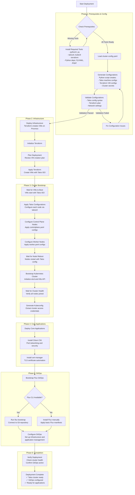

# InfraFlux v2.0 Deployment Flowchart

## Overview

This flowchart shows the complete deployment process for InfraFlux v2.0, from initial configuration to a fully operational Kubernetes cluster with GitOps.



## Key Components

### 1. Configuration Management

- **Single Source of Truth**: `config/cluster-config.yaml` drives entire deployment
- **Template Generation**: Jinja2 templates create Talos and Terraform configs
- **Validation**: Comprehensive pre-deployment validation prevents issues

### 2. Infrastructure as Code

- **Proxmox Integration**: Terraform creates VMs with Talos ISO
- **Immutable Infrastructure**: VMs boot directly from Talos ISO
- **No SSH Required**: All management via Talos API

### 3. Cluster Lifecycle

- **Automated Bootstrap**: talosctl handles cluster initialization
- **Certificate Management**: Automatic PKI setup and rotation
- **Health Monitoring**: Built-in health checks and validation

### 4. GitOps Transition

- **Flux v2**: Modern GitOps operator for Kubernetes
- **Declarative Management**: All applications managed through Git
- **Continuous Reconciliation**: Automatic drift detection and correction

## Deployment Commands

### Full Deployment

```bash
./deploy.sh config/cluster-config.yaml all
```

### Phase-by-Phase Deployment

```bash
# Infrastructure only
./deploy.sh config/cluster-config.yaml infrastructure

# Cluster bootstrap only
./deploy.sh config/cluster-config.yaml cluster

# Core applications only
./deploy.sh config/cluster-config.yaml apps

# GitOps setup only
./deploy.sh config/cluster-config.yaml gitops
```

## Post-Deployment

After successful deployment, you will have:

1. **Talos Kubernetes Cluster**: Immutable, secure, API-driven infrastructure
2. **Flux GitOps**: Continuous delivery system for applications
3. **Core Components**: Cilium networking, cert-manager for TLS
4. **Monitoring Ready**: Infrastructure prepared for observability stack

The cluster is now ready for application deployment through GitOps workflows managed by Flux v2.
