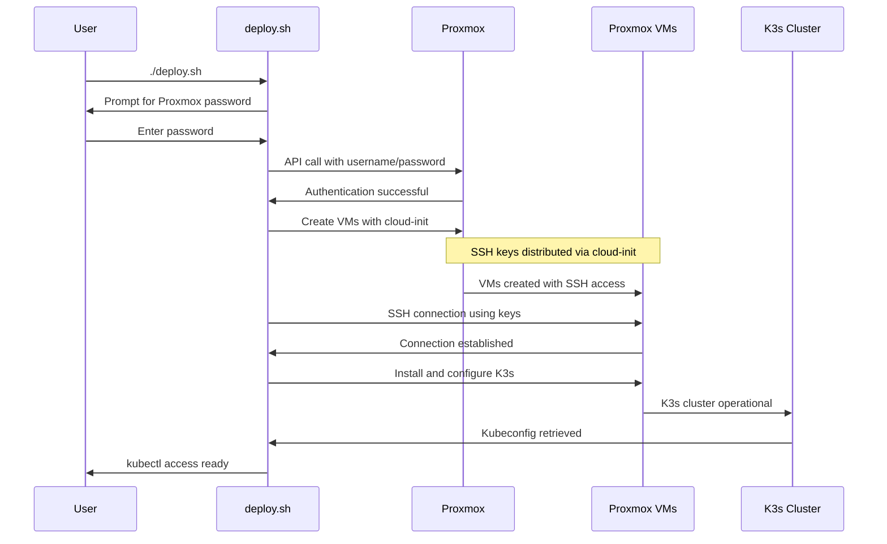

# InfraFlux Deployment Flowchart

This document provides a comprehensive visual representation of the InfraFlux deployment process, showing the complete flow from initial configuration to a fully operational Kubernetes cluster.

## 🌊 Complete Deployment Flow

```mermaid
flowchart TD
    %% Start
    Start([User starts deployment]) --> Config[./configure.sh]
    
    %% Configuration Phase
    Config --> ConfigCheck{Config exists?}
    ConfigCheck -->|No| Interactive[Interactive Configuration Wizard]
    ConfigCheck -->|Yes| ValidateConfig[Validate existing config]
    
    Interactive --> NetworkDetect[Auto-detect network settings]
    NetworkDetect --> ProxmoxConfig[Configure Proxmox settings]
    ProxmoxConfig --> VMConfig[Configure VM specifications]
    VMConfig --> AppConfig[Select applications to install]
    AppConfig --> GenerateConfig[Generate cluster-config.yaml]
    
    ValidateConfig --> GenerateConfig
    GenerateConfig --> Deploy[./deploy.sh]
    
    %% Prerequisites and Setup
    Deploy --> PreReq[Check Prerequisites]
    PreReq --> PreReqMissing{Missing tools?}
    PreReqMissing -->|Yes| InstallTools[Install missing tools<br/>ansible, terraform, yq, kubectl]
    PreReqMissing -->|No| ParseConfig[Parse Configuration]
    InstallTools --> ParseConfig
    
    ParseConfig --> NetworkAuto{Network = auto?}
    NetworkAuto -->|Yes| DetectNet[Auto-detect network CIDR]
    NetworkAuto -->|No| UseConfig[Use configured network]
    DetectNet --> ExtraVars[Generate extra_vars.yml]
    UseConfig --> ExtraVars
    
    ExtraVars --> ProxmoxPass[Prompt for Proxmox password]
    ProxmoxPass --> PhaseSelect{Phase Selection}
    
    %% Phase Selection
    PhaseSelect -->|all| Phase1[Phase 1: Infrastructure]
    PhaseSelect -->|infrastructure| Phase1
    PhaseSelect -->|k3s| Phase3[Phase 3: K3s Cluster]
    PhaseSelect -->|apps| Phase4[Phase 4: Applications]
    
    %% Phase 1: Infrastructure
    Phase1 --> TerraformDir[Create Terraform working directory]
    TerraformDir --> CopyTF[Copy Terraform templates]
    CopyTF --> TFVars[Generate terraform.tfvars from config]
    TFVars --> TFInit[terraform init]
    TFInit --> TFPlan[terraform plan]
    TFPlan --> TFApply[terraform apply]
    TFApply --> ExtractIPs[Extract VM IP addresses]
    ExtractIPs --> WaitVMs[Wait for VMs to be accessible<br/>SSH port 22]
    WaitVMs --> GenInventory[Generate dynamic Ansible inventory]
    GenInventory --> Phase1Complete[✅ Infrastructure Complete]
    
    %% Phase 2: Node Preparation (Auto in full deployment)
    Phase1Complete --> Phase2[Phase 2: Node Preparation]
    Phase2 --> UpdateNodes[Update system packages]
    UpdateNodes --> InstallDeps[Install dependencies<br/>curl, wget, docker, etc.]
    InstallDeps --> ConfigFirewall[Configure firewall rules]
    ConfigFirewall --> DisableSwap[Disable swap for Kubernetes]
    DisableSwap --> SSHKeys[Distribute SSH keys]
    SSHKeys --> Phase2Complete[✅ Node Preparation Complete]
    
    %% Phase 3: K3s Cluster
    Phase2Complete --> Phase3
    Phase3 --> K3sFirst[Install K3s on first controller<br/>--cluster-init]
    K3sFirst --> WaitFirst[Wait for first server ready<br/>Port 6443]
    WaitFirst --> VerifyFirst[Verify server health<br/>/healthz endpoint]
    VerifyFirst --> K3sAdditional[Install K3s on additional controllers<br/>--server https://first:6443]
    K3sAdditional --> K3sWorkers[Install K3s agents on workers<br/>K3S_URL + K3S_TOKEN]
    K3sWorkers --> ConfigKubectl[Configure kubectl access]
    ConfigKubectl --> FetchKubeconfig[Fetch kubeconfig to local machine]
    FetchKubeconfig --> VerifyCluster[Verify cluster status<br/>kubectl get nodes]
    VerifyCluster --> Phase3Complete[✅ K3s Cluster Complete]
    
    %% Phase 4: Applications
    Phase3Complete --> Phase4
    Phase4 --> NativeK3s{Native K3s features}
    NativeK3s --> TraefikCheck{Traefik enabled?}
    TraefikCheck -->|Yes| TraefikDash[Configure Traefik dashboard]
    TraefikCheck -->|No| SkipTraefik[Skip Traefik setup]
    TraefikDash --> CiliumCheck{Cilium CNI?}
    SkipTraefik --> CiliumCheck
    
    CiliumCheck -->|Yes| InstallCilium[Install Cilium CNI<br/>+ Hubble observability]
    CiliumCheck -->|No| SkipCilium[Use default CNI]
    InstallCilium --> CertManager{Cert-Manager?}
    SkipCilium --> CertManager
    
    CertManager -->|Yes| InstallCertMgr[Install cert-manager<br/>SSL certificates]
    CertManager -->|No| MonitoringCheck{Monitoring enabled?}
    InstallCertMgr --> MonitoringCheck
    
    MonitoringCheck -->|Yes| InstallPrometheus[Install Prometheus stack<br/>Grafana + AlertManager]
    MonitoringCheck -->|No| BackupCheck{Backup enabled?}
    InstallPrometheus --> BackupCheck
    
    BackupCheck -->|Yes| InstallVelero[Install Velero<br/>Kubernetes backup]
    BackupCheck -->|No| Phase4Complete[✅ Applications Complete]
    InstallVelero --> Phase4Complete
    
    %% Enhanced Features (Future)
    Phase4Complete --> EnhancedFeatures{Enhanced features?}
    EnhancedFeatures -->|Yes| Phase5[Phase 5: Security & Auth]
    EnhancedFeatures -->|No| DeployComplete[🎉 Deployment Complete]
    
    %% Phase 5: Security (Enhanced)
    Phase5 --> AuthProvider{Authentication provider?}
    AuthProvider -->|authelia| InstallAuthelia[Install Authelia<br/>Forward auth + 2FA]
    AuthProvider -->|authentik| InstallAuthentik[Install Authentik<br/>Identity provider]
    AuthProvider -->|none| CrowdSecCheck{CrowdSec security?}
    
    InstallAuthelia --> CrowdSecCheck
    InstallAuthentik --> CrowdSecCheck
    CrowdSecCheck -->|Yes| InstallCrowdSec[Install CrowdSec<br/>Behavioral security]
    CrowdSecCheck -->|No| SealedSecrets{Sealed secrets?}
    InstallCrowdSec --> SealedSecrets
    
    SealedSecrets -->|Yes| InstallSealed[Install Sealed Secrets<br/>GitOps-ready secrets]
    SealedSecrets -->|No| Phase5Complete[✅ Security Complete]
    InstallSealed --> Phase5Complete
    
    %% Phase 6: Enhanced Monitoring (Future)
    Phase5Complete --> Phase6[Phase 6: Enhanced Monitoring]
    Phase6 --> LogAggregation{Log aggregation?}
    LogAggregation -->|Yes| InstallLoki[Install Loki + Promtail<br/>Log collection]
    LogAggregation -->|No| AlertChannels{Alert channels?}
    InstallLoki --> AlertChannels
    
    AlertChannels -->|Yes| ConfigAlerts[Configure Discord/Slack alerts]
    AlertChannels -->|No| UptimeCheck{Uptime monitoring?}
    ConfigAlerts --> UptimeCheck
    
    UptimeCheck -->|Yes| InstallUptime[Install Uptime Kuma<br/>Service monitoring]
    UptimeCheck -->|No| Phase6Complete[✅ Enhanced Monitoring Complete]
    InstallUptime --> Phase6Complete
    
    %% Final Steps
    Phase6Complete --> DeployComplete
    DeployComplete --> ShowInfo[Display cluster information]
    ShowInfo --> ShowAccess[Show access URLs and commands]
    ShowAccess --> End([🚀 Happy Kubernetesing!])
    
    %% Error Handling
    TFApply -->|Error| TFError[❌ Terraform deployment failed]
    K3sFirst -->|Error| K3sError[❌ K3s installation failed]
    InstallPrometheus -->|Error| AppError[❌ Application installation failed]
    
    TFError --> Troubleshoot[Check Proxmox connectivity<br/>Verify credentials<br/>Check network settings]
    K3sError --> DebugK3s[Check VM accessibility<br/>Verify SSH connectivity<br/>Check system resources]
    AppError --> DebugApps[Check cluster status<br/>Verify node resources<br/>Check application logs]
    
    Troubleshoot --> Retry{Retry deployment?}
    DebugK3s --> Retry
    DebugApps --> Retry
    Retry -->|Yes| Deploy
    Retry -->|No| End
    
    %% Styling
    classDef phase fill:#e1f5fe,stroke:#01579b,stroke-width:2px
    classDef complete fill:#e8f5e8,stroke:#2e7d32,stroke-width:2px
    classDef error fill:#ffebee,stroke:#c62828,stroke-width:2px
    classDef decision fill:#fff3e0,stroke:#f57c00,stroke-width:2px
    
    class Phase1,Phase2,Phase3,Phase4,Phase5,Phase6 phase
    class Phase1Complete,Phase2Complete,Phase3Complete,Phase4Complete,Phase5Complete,Phase6Complete,DeployComplete complete
    class TFError,K3sError,AppError error
    class ConfigCheck,PreReqMissing,NetworkAuto,PhaseSelect,NativeK3s,TraefikCheck,CiliumCheck,CertManager,MonitoringCheck,BackupCheck,AuthProvider,CrowdSecCheck,SealedSecrets,LogAggregation,AlertChannels,UptimeCheck,Retry decision
```

## 🔄 Authentication Flow Detail

## 📋 Phase Breakdown

### Phase 1: Infrastructure
- **Duration**: 5-10 minutes
- **Actions**: VM creation, network setup, cloud-init
- **Output**: Ready VMs with SSH access

### Phase 2: Node Preparation  
- **Duration**: 3-5 minutes
- **Actions**: System updates, dependency installation, security hardening
- **Output**: Kubernetes-ready nodes

### Phase 3: K3s Cluster
- **Duration**: 5-8 minutes
- **Actions**: K3s installation, cluster formation, kubectl setup
- **Output**: Functional Kubernetes cluster

### Phase 4: Applications
- **Duration**: 10-15 minutes
- **Actions**: Native K3s apps, monitoring stack, certificates
- **Output**: Production-ready cluster with applications

### Phase 5: Security (Enhanced)
- **Duration**: 5-10 minutes
- **Actions**: Authentication system, security hardening
- **Output**: Secured cluster with SSO

### Phase 6: Enhanced Monitoring (Enhanced)
- **Duration**: 5-8 minutes  
- **Actions**: Log aggregation, advanced alerting
- **Output**: Comprehensive observability stack

## 🛠️ Troubleshooting Decision Points

### Common Issues and Solutions

**VM Creation Fails**:
- Check Proxmox API connectivity
- Verify credentials and permissions
- Ensure template exists and is accessible
- Check storage availability

**K3s Installation Fails**:
- Verify VM SSH connectivity
- Check system resources (CPU, memory)
- Ensure swap is disabled
- Verify internet connectivity for downloads

**Application Installation Fails**:
- Check cluster node status
- Verify sufficient resources
- Check network connectivity
- Review application-specific logs

## 🎯 Success Indicators

- ✅ All VMs created and accessible
- ✅ K3s cluster nodes in Ready state  
- ✅ Core applications running
- ✅ Ingress controller operational
- ✅ Monitoring stack accessible
- ✅ Backup system configured

## 📊 Resource Requirements

**Minimum per VM**:
- CPU: 2 cores
- Memory: 4GB
- Disk: 20GB
- Network: 1 Gbps

**Recommended for production**:
- Controllers: 3 nodes (HA)
- Workers: 3+ nodes (workload distribution)
- Storage: NFS or distributed storage
- Backup: External storage for Velero

## Key Improvements Implemented

1. **Native K3s features enabled** - Traefik and ServiceLB by default
2. **Simplified folder structure** - Unified deployment method
3. **Clear authentication separation** - Proxmox password, VM SSH keys
4. **Terraform integration** - Complete VM provisioning workflow
5. **Enhanced error handling** - Comprehensive troubleshooting paths
6. **Organized documentation** - All docs in dedicated folder

This flowchart provides a complete visual guide to understanding the InfraFlux deployment process, making it easier to debug issues and understand the system architecture.
