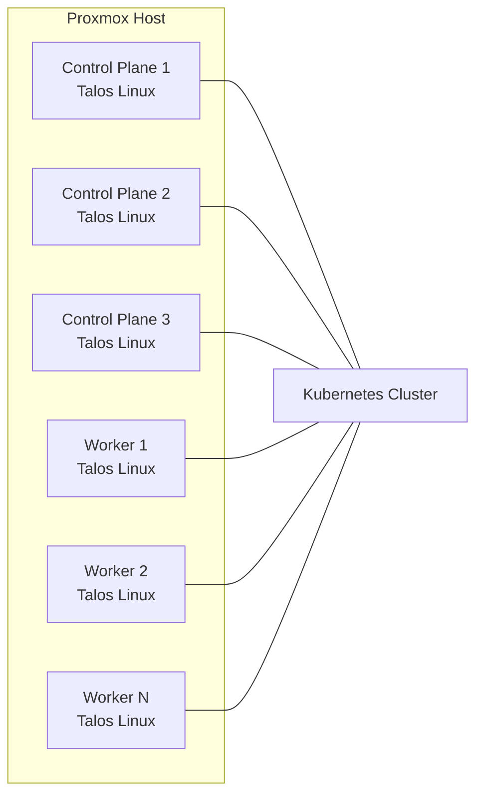
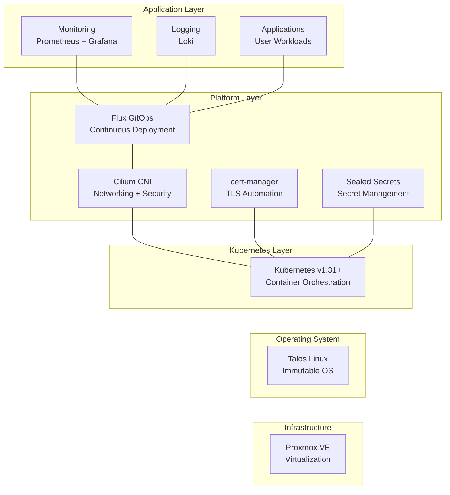

# InfraFlux v2.0 Deployment Flowchart

## Overview

This flowchart illustrates the complete deployment pipeline for InfraFlux v2.0, transforming from configuration to a production-ready immutable Kubernetes platform. The process follows a strict phase-based approach with validation gates and automated rollback capabilities.

**Key Architecture**: Talos Linux VMs → Immutable Kubernetes → Flux GitOps → Automated Applications

**Deployment Command**: `ansible-playbook playbooks/main.yml --extra-vars config_file=config/cluster.yaml --extra-vars deployment_phase=all

## Complete Deployment Flow

```mermaid
graph TD
    START([🚀 ./deploy.sh]) --> CONFIG{📋 Load Config<br/>cluster.yaml}

    CONFIG -->|❌ Invalid| CONFIG_ERROR[❌ Configuration Error<br/>Fix config file]
    CONFIG_ERROR --> CONFIG
    CONFIG -->|✅ Valid| PREREQ[🔧 Phase 1: Prerequisites]

    %% Phase 1: Prerequisites
    PREREQ --> CHECK_TOOLS{Check Required Tools}
    CHECK_TOOLS -->|Missing| INSTALL_TOOLS[Install Missing Tools<br/>• python3 + PyYAML, Jinja2<br/>• talosctl, kubectl<br/>• terraform<br/>• yq, curl]
    INSTALL_TOOLS --> CHECK_TOOLS
    CHECK_TOOLS -->|✅ All Present| CHECK_PROXMOX{Verify Proxmox Access}
    CHECK_PROXMOX -->|❌ Failed| PROXMOX_ERROR[❌ Proxmox Connection Error<br/>Check credentials/network]
    CHECK_PROXMOX -->|✅ Connected| GENERATE[🏗️ Phase 2: Configuration Generation]

    %% Phase 2: Configuration Generation
    GENERATE --> PYTHON_GEN[📝 Run generate-configs.py<br/>Creates from templates:<br/>• Talos controlplane.yaml<br/>• Talos worker.yaml<br/>• Terraform main.tf<br/>• Flux configurations]
    PYTHON_GEN --> VALIDATE_CONFIG[🔍 Validate Generated Configs<br/>• Talos config syntax<br/>• Terraform plan check<br/>• Network validation]
    VALIDATE_CONFIG -->|❌ Invalid| CONFIG_FIX[❌ Fix Generated Configs]
    CONFIG_FIX --> PYTHON_GEN
    VALIDATE_CONFIG -->|✅ Valid| INFRASTRUCTURE[🏗️ Phase 3: Infrastructure Deployment]

    %% Phase 3: Infrastructure
    INFRASTRUCTURE --> TF_INIT[terraform init<br/>Initialize providers]
    TF_INIT --> TF_PLAN[terraform plan<br/>Review VM creation plan]
    TF_PLAN --> TF_APPLY[terraform apply<br/>Create VMs on Proxmox<br/>• Control plane nodes<br/>• Worker nodes<br/>• Attach Talos ISO]
    TF_APPLY -->|❌ Failed| INFRA_ERROR[❌ Infrastructure Error<br/>Check Proxmox/Terraform]
    TF_APPLY -->|✅ Success| WAIT_BOOT[⏳ Wait for VM Boot<br/>VMs start from Talos ISO]

    %% Phase 4: Talos Cluster Bootstrap
    WAIT_BOOT --> TALOS_CONFIG[🔧 Phase 4: Talos Configuration]
    TALOS_CONFIG --> APPLY_CP[talosctl apply-config<br/>Configure control plane nodes]
    APPLY_CP --> APPLY_WORKER[talosctl apply-config<br/>Configure worker nodes]
    APPLY_WORKER --> WAIT_REBOOT[⏳ Wait for Node Reboot<br/>Nodes restart with Talos]
    WAIT_REBOOT --> BOOTSTRAP_K8S[🚀 talosctl bootstrap<br/>Initialize Kubernetes cluster<br/>• etcd cluster<br/>• API server<br/>• Controller manager]
    BOOTSTRAP_K8S --> WAIT_READY[⏳ Wait for Cluster Ready<br/>All nodes join cluster]
    WAIT_READY --> GET_KUBECONFIG[📝 Extract kubeconfig<br/>talosctl kubeconfig]

    %% Phase 5: Core Infrastructure
    GET_KUBECONFIG --> CORE_INFRA[🔧 Phase 5: Core Infrastructure]
    CORE_INFRA --> INSTALL_CILIUM[🌐 Install Cilium CNI<br/>• Pod networking<br/>• Network policies<br/>• Load balancing]
    INSTALL_CILIUM --> INSTALL_CERT[🔒 Install cert-manager<br/>• TLS automation<br/>• Let's Encrypt integration]
    INSTALL_CERT --> INSTALL_SEALED[🔐 Install Sealed Secrets<br/>• GitOps-safe secrets<br/>• Encryption at rest]

    %% Phase 6: GitOps Bootstrap
    INSTALL_SEALED --> GITOPS[🔄 Phase 6: GitOps Bootstrap]
    GITOPS --> CHECK_FLUX{flux CLI Available?}
    CHECK_FLUX -->|No| INSTALL_FLUX[Install Flux CLI]
    INSTALL_FLUX --> CHECK_FLUX
    CHECK_FLUX -->|Yes| FLUX_BOOTSTRAP[🚀 flux bootstrap git<br/>• Connect to Git repository<br/>• Install Flux controllers<br/>• Setup GitOps sync]
    FLUX_BOOTSTRAP --> FLUX_CONFIG[⚙️ Configure Flux Sources<br/>• Helm repositories<br/>• Git repositories<br/>• Image registries]

    %% Phase 7: Application Deployment
    FLUX_CONFIG --> APP_DEPLOY[📦 Phase 7: Application Deployment]
    APP_DEPLOY --> INFRA_SYNC[🔄 Sync Infrastructure<br/>Flux deploys:<br/>• Network policies<br/>• RBAC policies<br/>• Monitoring stack]
    INFRA_SYNC --> APP_SYNC[🔄 Sync Applications<br/>Flux deploys:<br/>• Monitoring (Prometheus, Grafana)<br/>• Logging (Loki)<br/>• Security tools]

    %% Phase 8: Validation & Completion
    APP_SYNC --> VALIDATION[✅ Phase 8: Validation]
    VALIDATION --> HEALTH_CHECK[🏥 Cluster Health Check<br/>• All nodes ready<br/>• Core pods running<br/>• Network connectivity]
    HEALTH_CHECK --> GITOPS_CHECK[🔄 GitOps Health Check<br/>• Flux controllers ready<br/>• Git sync active<br/>• Applications deployed]
    GITOPS_CHECK --> SECURITY_CHECK[🔒 Security Validation<br/>• Pod security policies<br/>• Network policies<br/>• RBAC permissions]
    SECURITY_CHECK --> COMPLETE[🎉 Deployment Complete!<br/>✅ Immutable Talos cluster<br/>✅ GitOps-managed<br/>✅ Production ready]

    %% Error Handling & Rollback
    INFRAFLUX_ERROR[❌ Critical Error Detected] --> ROLLBACK_DECISION{Auto Rollback?}
    ROLLBACK_DECISION -->|Yes| AUTO_ROLLBACK[🔙 Automatic Rollback<br/>• Destroy failed resources<br/>• Restore previous state<br/>• Generate error report]
    ROLLBACK_DECISION -->|No| MANUAL_FIX[🛠️ Manual Intervention Required<br/>Check logs and fix issues]

    %% Styling
    classDef phaseBox fill:#e1f5fe,stroke:#0277bd,stroke-width:2px
    classDef successBox fill:#e8f5e8,stroke:#2e7d32,stroke-width:2px
    classDef errorBox fill:#ffebee,stroke:#c62828,stroke-width:2px
    classDef processBox fill:#f3e5f5,stroke:#7b1fa2,stroke-width:2px

    class PREREQ,GENERATE,INFRASTRUCTURE,TALOS_CONFIG,CORE_INFRA,GITOPS,APP_DEPLOY,VALIDATION phaseBox
    class COMPLETE successBox
    class CONFIG_ERROR,PROXMOX_ERROR,INFRA_ERROR,INFRAFLUX_ERROR,CONFIG_FIX errorBox
    class PYTHON_GEN,TF_APPLY,BOOTSTRAP_K8S,FLUX_BOOTSTRAP processBox
```

## Deployment Phases Detail

### Phase 1: Prerequisites & Configuration

- **Duration**: 2-5 minutes
- **Purpose**: Ensure system readiness and validate configuration
- **Key Actions**:
  - Verify required tools installation
  - Validate Proxmox connectivity
  - Load and parse `cluster.yaml`
  - Generate all Talos and Terraform configurations

### Phase 2: Infrastructure Deployment

- **Duration**: 5-10 minutes
- **Purpose**: Create VM infrastructure on Proxmox
- **Key Actions**:
  - Terraform initialization and planning
  - VM creation with Talos ISO attachment
  - Network configuration and resource allocation

### Phase 3: Talos Cluster Bootstrap

- **Duration**: 5-15 minutes
- **Purpose**: Initialize immutable Kubernetes cluster
- **Key Actions**:
  - Apply Talos machine configurations
  - Bootstrap Kubernetes control plane
  - Join worker nodes to cluster
  - Extract cluster credentials

### Phase 4: Core Infrastructure

- **Duration**: 3-8 minutes
- **Purpose**: Install essential cluster services
- **Key Actions**:
  - Deploy Cilium CNI for networking
  - Install cert-manager for TLS automation
  - Setup Sealed Secrets for GitOps security

### Phase 5: GitOps Bootstrap

- **Duration**: 2-5 minutes
- **Purpose**: Establish GitOps management
- **Key Actions**:
  - Install and configure Flux v2
  - Connect to Git repository
  - Setup continuous deployment pipeline

### Phase 6: Application Deployment

- **Duration**: 5-15 minutes
- **Purpose**: Deploy platform applications via GitOps
- **Key Actions**:
  - Sync infrastructure manifests
  - Deploy monitoring stack (Prometheus, Grafana, Loki)
  - Apply security policies and network rules

### Phase 7: Validation & Health Checks

- **Duration**: 2-3 minutes
- **Purpose**: Verify complete system functionality
- **Key Actions**:
  - Cluster health validation
  - GitOps sync verification
  - Security policy enforcement check

## Architecture Components

### Infrastructure Layer



### Software Stack



## Key Features

### 🛡️ **Immutable Infrastructure**

- **Talos Linux**: Purpose-built immutable OS for Kubernetes
- **No SSH Access**: All operations via secure APIs
- **Configuration as Code**: Complete infrastructure defined in Git

### 🔄 **GitOps Automation**

- **Flux v2**: Automated application lifecycle management
- **Git Single Source**: All changes tracked and auditable
- **Continuous Sync**: Automatic drift detection and correction

### 🔒 **Security by Design**

- **Zero Trust Networking**: Cilium network policies
- **Pod Security Standards**: Kubernetes security enforcement
- **Sealed Secrets**: Encrypted secrets in Git repositories

### 📊 **Observability**

- **Prometheus**: Metrics collection and alerting
- **Grafana**: Visualization and dashboards
- **Loki**: Log aggregation and analysis

### 🚀 **Operational Excellence**

- **One Command Deployment**: `./deploy.sh` for complete setup
- **Automatic Rollback**: Failed deployments automatically reverted
- **Health Monitoring**: Continuous validation of cluster state

## Deployment Commands

### Full Deployment

```bash
ansible-playbook playbooks/main.yml --extra-vars config_file=config/cluster.yaml --extra-vars deployment_phase=all all
```

### Phase-by-Phase Deployment

```bash
# Infrastructure only
ansible-playbook playbooks/main.yml --extra-vars config_file=config/cluster.yaml --extra-vars deployment_phase=infrastructure

# Cluster bootstrap only
ansible-playbook playbooks/main.yml --extra-vars config_file=config/cluster.yaml --extra-vars deployment_phase=cluster

# Core applications only
ansible-playbook playbooks/main.yml --extra-vars config_file=config/cluster.yaml --extra-vars deployment_phase=apps

# GitOps setup only
ansible-playbook playbooks/main.yml --extra-vars config_file=config/cluster.yaml --extra-vars deployment_phase=all gitops
```

## Post-Deployment

After successful deployment, you will have:

1. **Talos Kubernetes Cluster**: Immutable, secure, API-driven infrastructure
2. **Flux GitOps**: Continuous delivery system for applications
3. **Core Components**: Cilium networking, cert-manager for TLS
4. **Monitoring Ready**: Infrastructure prepared for observability stack

The cluster is now ready for application deployment through GitOps workflows managed by Flux v2.

## Error Recovery

The deployment system includes comprehensive error handling:

1. **Automatic Validation**: Pre-flight checks prevent common issues
2. **Rollback Capability**: Failed deployments automatically cleaned up
3. **Detailed Logging**: All operations logged for troubleshooting
4. **Health Checks**: Continuous monitoring of deployment progress
5. **Manual Override**: Option to skip phases or force continuation

This deployment pipeline ensures a reliable, repeatable path from configuration to production-ready Kubernetes infrastructure.
