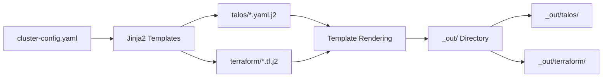
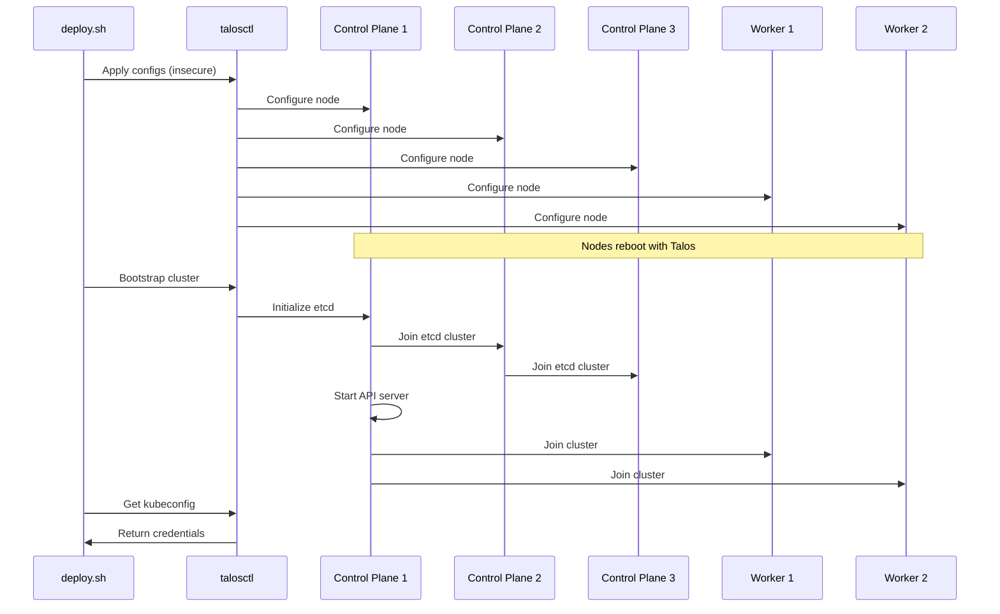
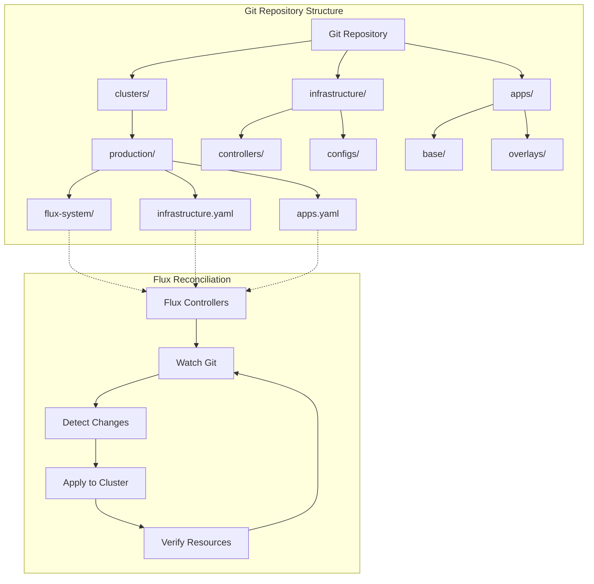

# InfraFlux v2.0 Complete Deployment Flowchart

## Executive Summary

InfraFlux v2.0 implements a fully automated deployment pipeline that provisions Talos Linux VMs on Proxmox, bootstraps an immutable Kubernetes cluster, and establishes FluxCD-based GitOps management. The entire process is orchestrated through a single command: `./deploy.sh config/cluster-config.yaml`.

## Master Deployment Flow

```mermaid
graph TB
    subgraph "Entry Point"
        START([🚀 Start: ./deploy.sh]) --> LOAD_CONFIG[📋 Load cluster-config.yaml]
        LOAD_CONFIG --> PARSE_PHASE{Parse Deployment Phase}
    end

    subgraph "Phase 1: Prerequisites & Validation"
        PARSE_PHASE --> CHECK_TOOLS[🔧 Check Required Tools]
        CHECK_TOOLS --> TOOLS_LIST["""
            Required Tools:
            • python3 + PyYAML/Jinja2
            • talosctl (Talos CLI)
            • kubectl (Kubernetes CLI)
            • terraform (Infrastructure)
            • yq (YAML processor)
            • flux (optional)
        """]
        TOOLS_LIST --> VALIDATE_CONFIG[🔍 Validate Configuration]
        VALIDATE_CONFIG --> CONFIG_CHECKS["""
            Configuration Checks:
            • YAML syntax validation
            • IP address format
            • Resource specifications
            • Proxmox credentials
            • Git repository access
        """]
    end

    subgraph "Phase 2: Configuration Generation"
        CONFIG_CHECKS --> GEN_CONFIGS[📝 generate-configs.py]
        GEN_CONFIGS --> GEN_TALOS["""
            Generate Talos Configs:
            • controlplane-0.yaml
            • controlplane-1.yaml
            • controlplane-2.yaml
            • worker-0.yaml
            • worker-1.yaml
            • talosconfig
        """]
        GEN_TALOS --> GEN_TERRAFORM["""
            Generate Terraform:
            • main.tf (from template)
            • variables.tf
            • terraform.tfvars
        """]
        GEN_TERRAFORM --> GEN_SECRETS[🔐 Generate Talos Secrets]
    end

    subgraph "Phase 3: Infrastructure Provisioning (Proxmox)"
        GEN_SECRETS --> TF_INIT[terraform init]
        TF_INIT --> TF_PLAN[terraform plan]
        TF_PLAN --> PROXMOX_AUTH[🔑 Proxmox Authentication]
        PROXMOX_AUTH --> CREATE_VMS["""
            Create VMs on Proxmox:
            • 3x Control Plane VMs
            • 2x Worker VMs
            • Attach Talos ISO
            • Configure networking
            • Set resource limits
        """]
        CREATE_VMS --> VM_BOOT[⏳ Wait for VM Boot]
    end

    subgraph "Phase 4: Talos OS Bootstrap"
        VM_BOOT --> APPLY_TALOS[📤 Apply Talos Configurations]
        APPLY_TALOS --> CP_CONFIG["""
            Control Plane Config:
            • API server settings
            • etcd configuration
            • Cluster certificates
            • Network settings
        """]
        CP_CONFIG --> WORKER_CONFIG["""
            Worker Config:
            • Join tokens
            • Kubelet settings
            • Container runtime
        """]
        WORKER_CONFIG --> TALOS_BOOTSTRAP[🚀 talosctl bootstrap]
        TALOS_BOOTSTRAP --> WAIT_CLUSTER[⏳ Wait for Cluster Formation]
    end

    subgraph "Phase 5: Kubernetes Initialization"
        WAIT_CLUSTER --> VERIFY_NODES[✅ Verify All Nodes Ready]
        VERIFY_NODES --> EXTRACT_KUBECONFIG[📝 Extract kubeconfig]
        EXTRACT_KUBECONFIG --> K8S_READY["""
            Kubernetes Cluster Ready:
            • API server accessible
            • etcd cluster healthy
            • All nodes joined
            • Core components running
        """]
    end

    subgraph "Phase 6: Core Infrastructure Components"
        K8S_READY --> INSTALL_CILIUM[🌐 Install Cilium CNI]
        INSTALL_CILIUM --> CILIUM_FEATURES["""
            Cilium Features:
            • Pod networking
            • Network policies
            • Load balancing
            • eBPF security
        """]
        CILIUM_FEATURES --> INSTALL_CERTMGR[🔒 Install cert-manager]
        INSTALL_CERTMGR --> CERTMGR_CONFIG["""
            cert-manager Config:
            • ClusterIssuers
            • Let's Encrypt
            • Certificate automation
        """]
        CERTMGR_CONFIG --> INSTALL_SEALED[🔐 Install Sealed Secrets]
    end

    subgraph "Phase 7: FluxCD GitOps Bootstrap"
        INSTALL_SEALED --> FLUX_CHECK{flux CLI available?}
        FLUX_CHECK -->|No| INSTALL_FLUX_MANUAL[Install Flux Controllers]
        FLUX_CHECK -->|Yes| FLUX_BOOTSTRAP[🔄 flux bootstrap git]
        INSTALL_FLUX_MANUAL --> FLUX_BOOTSTRAP
        FLUX_BOOTSTRAP --> FLUX_COMPONENTS["""
            Flux Components:
            • Source controller
            • Kustomize controller
            • Helm controller
            • Notification controller
        """]
        FLUX_COMPONENTS --> GIT_SYNC["""
            Git Repository Sync:
            • Connect to Git repo
            • Setup SSH keys
            • Configure branches
            • Initial reconciliation
        """]
    end

    subgraph "Phase 8: GitOps Application Deployment"
        GIT_SYNC --> FLUX_SOURCES[📦 Configure Flux Sources]
        FLUX_SOURCES --> HELM_REPOS["""
            Helm Repositories:
            • prometheus-community
            • grafana
            • cilium
            • jetstack
        """]
        HELM_REPOS --> DEPLOY_INFRA[🏗️ Deploy Infrastructure Apps]
        DEPLOY_INFRA --> INFRA_APPS["""
            Infrastructure Apps:
            • Monitoring namespace
            • Network policies
            • RBAC policies
            • Storage classes
        """]
        INFRA_APPS --> DEPLOY_APPS[📱 Deploy User Applications]
        DEPLOY_APPS --> USER_APPS["""
            User Applications:
            • Prometheus + Grafana
            • Loki + Promtail
            • Authentik (SSO)
            • Custom apps
        """]
    end

    subgraph "Phase 9: Validation & Completion"
        USER_APPS --> FINAL_VALIDATION[✅ Final Validation]
        FINAL_VALIDATION --> HEALTH_CHECKS["""
            Health Checks:
            • All nodes ready
            • Core pods running
            • Flux sync successful
            • Apps accessible
            • Certificates valid
        """]
        HEALTH_CHECKS --> COMPLETE["""
            🎉 Deployment Complete!
            
            ✅ Immutable Talos cluster
            ✅ GitOps-managed apps
            ✅ Production ready
            ✅ Secure by default
        """]
    end

    subgraph "Error Handling"
        ERROR[❌ Error Detected] --> ERROR_TYPE{Error Type?}
        ERROR_TYPE -->|Infrastructure| ROLLBACK_VMS[Destroy VMs]
        ERROR_TYPE -->|Configuration| FIX_CONFIG[Fix Configuration]
        ERROR_TYPE -->|Network| CHECK_NETWORK[Check Connectivity]
        ERROR_TYPE -->|GitOps| CHECK_GIT[Check Git Access]
        
        ROLLBACK_VMS --> RETRY[🔄 Retry Deployment]
        FIX_CONFIG --> RETRY
        CHECK_NETWORK --> RETRY
        CHECK_GIT --> RETRY
    end

    %% Error connections
    CHECK_TOOLS -.->|Missing| ERROR
    VALIDATE_CONFIG -.->|Invalid| ERROR
    CREATE_VMS -.->|Failed| ERROR
    TALOS_BOOTSTRAP -.->|Failed| ERROR
    FLUX_BOOTSTRAP -.->|Failed| ERROR

    %% Styling
    classDef phaseStyle fill:#e3f2fd,stroke:#1976d2,stroke-width:2px,color:#000
    classDef successStyle fill:#e8f5e9,stroke:#388e3c,stroke-width:2px,color:#000
    classDef errorStyle fill:#ffebee,stroke:#d32f2f,stroke-width:2px,color:#000
    classDef configStyle fill:#f3e5f5,stroke:#7b1fa2,stroke-width:2px,color:#000
    
    class START,PARSE_PHASE phaseStyle
    class COMPLETE,K8S_READY successStyle
    class ERROR,ERROR_TYPE,ROLLBACK_VMS errorStyle
    class LOAD_CONFIG,GEN_CONFIGS,FLUX_BOOTSTRAP configStyle
```



## Detailed Component Flow

### 1. Configuration Processing Flow



### 2. Talos Bootstrap Sequence



### 3. FluxCD GitOps Flow



## Timing Estimates

| Phase | Duration | Description |
|-------|----------|-------------|
| Prerequisites | 1-2 min | Tool verification and setup |
| Config Generation | 30-60 sec | Template processing |
| Infrastructure | 5-10 min | VM creation on Proxmox |
| Talos Bootstrap | 5-15 min | OS installation and cluster init |
| Core Components | 3-5 min | CNI, cert-manager, secrets |
| GitOps Setup | 2-3 min | Flux installation |
| App Deployment | 5-10 min | Application rollout |
| Validation | 1-2 min | Health checks |
| **Total** | **23-48 min** | Complete deployment |

## Key Integration Points

### 1. Proxmox → Talos
- VMs created with Talos ISO attached
- Network configuration passed through cloud-init
- Resource specifications from config

### 2. Talos → Kubernetes
- Immutable OS provides secure foundation
- API-only access (no SSH)
- Automatic certificate rotation

### 3. Kubernetes → FluxCD
- Flux deployed as first workload
- Git repository becomes source of truth
- All changes tracked and auditable

### 4. FluxCD → Applications
- Continuous reconciliation
- Automatic updates from Git
- Multi-environment support

## Success Criteria

✅ **Infrastructure Ready**
- All VMs created and running
- Network connectivity established
- Talos OS installed

✅ **Cluster Operational**
- Kubernetes API accessible
- All nodes in Ready state
- Core components healthy

✅ **GitOps Active**
- Flux controllers running
- Git repository synced
- Initial reconciliation complete

✅ **Applications Deployed**
- Monitoring stack operational
- Security policies enforced
- User applications accessible

## Troubleshooting Guide

### Common Issues and Solutions

1. **VM Creation Fails**
   - Check Proxmox credentials
   - Verify resource availability
   - Review terraform logs

2. **Talos Bootstrap Fails**
   - Verify network connectivity
   - Check machine configs
   - Review talosctl logs

3. **Flux Sync Issues**
   - Verify Git credentials
   - Check repository structure
   - Review flux logs

4. **Application Failures**
   - Check namespace resources
   - Verify Helm values
   - Review pod logs

## Post-Deployment Operations

After successful deployment:

1. **Access Cluster**
   ```bash
   export KUBECONFIG=/tmp/infraflux-*/kubeconfig
   kubectl get nodes
   ```

2. **Monitor GitOps**
   ```bash
   flux get all
   flux logs --all-namespaces
   ```

3. **Deploy New Apps**
   - Add manifests to Git repository
   - Flux automatically syncs changes
   - Monitor deployment progress

This complete deployment flow ensures a reliable, repeatable, and secure path from bare metal to production-ready Kubernetes infrastructure managed by GitOps.