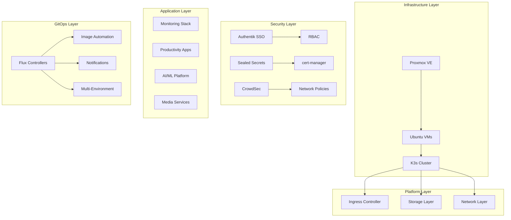
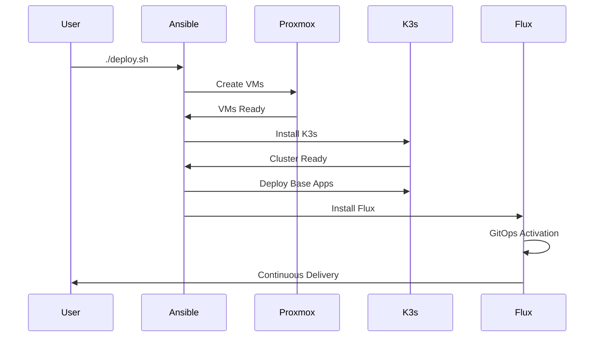
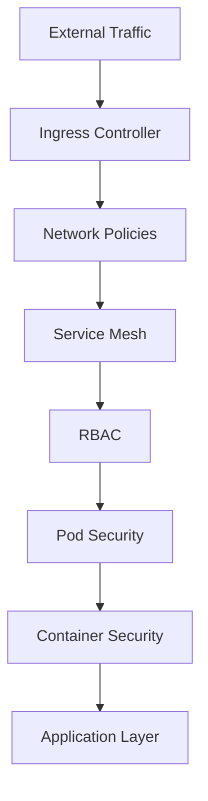

# Architecture Documentation

Comprehensive system design and architecture documentation for InfraFlux.

## 🏗️ Architecture Overview

InfraFlux is an **enterprise-grade Kubernetes homelab platform** that combines the reliability of traditional infrastructure automation with modern GitOps practices.

### Core Design Principles

1. **🔄 Hybrid Deployment**: Ansible for infrastructure, Flux for applications
2. **🛡️ Security First**: Enterprise-grade security from day one
3. **📈 Scalability**: From single node to multi-node clusters
4. **🔧 Zero Configuration**: Automated setup with sensible defaults
5. **📊 Observable**: Comprehensive monitoring and logging

## 🎯 System Architecture



## 🔧 Component Architecture

### 1. Infrastructure Components

| Component | Purpose | Technology | Status |
|-----------|---------|------------|--------|
| **VM Host** | Virtualization platform | Proxmox VE 8.0+ | ✅ Production |
| **Operating System** | Container runtime host | Ubuntu 24.04 LTS | ✅ Production |
| **Kubernetes** | Container orchestration | K3s v1.28.5+ | ✅ Production |
| **Container Runtime** | Pod execution | containerd | ✅ Production |
| **Network** | Pod networking | Cilium CNI | ✅ Production |
| **Storage** | Persistent volumes | local-path-provisioner | ✅ Production |
| **Load Balancer** | Service exposure | K3s ServiceLB | ✅ Production |
| **Ingress** | HTTP routing | Traefik v3.0+ | ✅ Production |

### 2. Security Components

| Component | Purpose | Implementation | Status |
|-----------|---------|----------------|--------|
| **SSO Provider** | Authentication | Authentik | ✅ Production |
| **Certificate Management** | TLS certificates | cert-manager | ✅ Production |
| **Secret Management** | Encrypted secrets | Sealed Secrets | ✅ Production |
| **RBAC** | Authorization | Kubernetes RBAC | ✅ Production |
| **Network Security** | Traffic control | Network Policies | ✅ Production |
| **Behavioral Security** | Threat detection | CrowdSec | ✅ Production |
| **Vulnerability Scanning** | Container security | Trivy | ✅ Production |

### 3. Observability Stack

| Component | Purpose | Implementation | Status |
|-----------|---------|----------------|--------|
| **Metrics Collection** | System metrics | Prometheus | ✅ Production |
| **Metrics Visualization** | Dashboards | Grafana | ✅ Production |
| **Log Aggregation** | Centralized logging | Loki | ✅ Production |
| **Log Visualization** | Log analysis | Grafana | ✅ Production |
| **Alerting** | Incident management | AlertManager | ✅ Production |
| **Network Observability** | Network monitoring | Hubble UI | ✅ Production |
| **Distributed Tracing** | Request tracing | Planned | 🔜 Future |

## 🚀 Deployment Architecture

### Phase-Based Deployment Model



#### Phase 1: Infrastructure (Ansible)
- **VM Provisioning**: Terraform + Proxmox API
- **OS Configuration**: System hardening, Docker, networking
- **K3s Installation**: Cluster bootstrap with native features
- **Base Applications**: Core infrastructure and monitoring

#### Phase 2: GitOps (Flux)
- **Flux Bootstrap**: GitOps controller installation
- **Application Management**: HelmRelease-based deployments
- **Image Automation**: Automated container updates
- **Multi-Environment**: Staging/production separation

### Network Architecture

```
┌─────────────────────────────────────────────────────────────┐
│                    External Network                         │
│                  (192.168.1.0/24)                         │
└─────────────────────┬───────────────────────────────────────┘
                      │
┌─────────────────────┴───────────────────────────────────────┐
│                 Proxmox Host                               │
│  ┌─────────────┬─────────────┬─────────────┬─────────────┐  │
│  │   Control   │   Worker    │   Worker    │   Worker    │  │
│  │   Plane     │   Node 1    │   Node 2    │   Node 3    │  │
│  │             │             │             │             │  │
│  └─────────────┴─────────────┴─────────────┴─────────────┘  │
└─────────────────────────────────────────────────────────────┘
                      │
┌─────────────────────┴───────────────────────────────────────┐
│              Kubernetes Cluster Network                    │
│                                                             │
│  Pod CIDR: 10.244.0.0/16                                  │
│  Service CIDR: 10.96.0.0/12                               │
│  Cluster DNS: 10.96.0.10                                  │
└─────────────────────────────────────────────────────────────┘
```

## 📊 Data Architecture

### Storage Patterns

| Data Type | Storage Solution | Backup Strategy | Retention |
|-----------|------------------|-----------------|-----------|
| **Application Data** | PersistentVolumes | Velero + Restic | 30 days |
| **Configuration** | Git Repository | Git history | Unlimited |
| **Secrets** | Sealed Secrets | Backup + restore | 90 days |
| **Logs** | Loki Storage | Rotation | 14 days |
| **Metrics** | Prometheus TSDB | Grafana export | 30 days |
| **Container Images** | Registry | Tag-based | 6 months |

### Namespace Architecture

```
flux-system          # Flux GitOps controllers
kube-system          # K3s system components
security             # Authentik, cert-manager, CrowdSec
monitoring           # Prometheus, Grafana, Loki
applications         # User applications
ai-ml                # AI/ML workloads (with GPU access)
media                # Media services (with GPU access)
```

## 🔐 Security Architecture

### Defense in Depth



#### Security Layers

1. **Network Security**
   - Firewall rules at host level
   - Kubernetes Network Policies
   - Cilium security policies

2. **Identity & Access**
   - Authentik SSO for human users
   - Service accounts for applications
   - RBAC for fine-grained permissions

3. **Data Protection**
   - Encrypted secrets at rest
   - TLS for all communications
   - Regular backup validation

4. **Runtime Security**
   - Pod Security Standards
   - Container image scanning
   - Behavioral anomaly detection

## ⚡ Performance Architecture

### Resource Allocation

| Component Category | CPU Request | Memory Request | Storage |
|-------------------|-------------|----------------|---------|
| **System Components** | 2 cores | 4 GB | 20 GB |
| **Monitoring Stack** | 1 core | 2 GB | 50 GB |
| **Security Stack** | 0.5 cores | 1 GB | 10 GB |
| **Applications** | Variable | Variable | Variable |
| **AI/ML Workloads** | Variable | Variable | 200+ GB |

### Scaling Strategy

- **Horizontal Pod Autoscaling**: Automatic pod scaling based on metrics
- **Vertical Pod Autoscaling**: Resource limit adjustments
- **Cluster Autoscaling**: Dynamic node addition/removal
- **Application-Level Scaling**: Load balancing and caching

## 🔮 Future Architecture

### Planned Enhancements

1. **Multi-Cluster Management**
   - Cluster API for cluster lifecycle
   - Cross-cluster service mesh
   - Federated monitoring

2. **Advanced Security**
   - Service mesh security policies
   - Advanced threat detection
   - Compliance automation

3. **Edge Computing**
   - Edge node support
   - Distributed storage
   - Low-latency applications

4. **AI/ML Platform**
   - Model serving infrastructure
   - Distributed training
   - GPU resource sharing

## 📖 Reference Documentation

- [Infrastructure Deployment](../infrastructure/) - How to deploy
- [GitOps Workflows](../gitops/) - How to manage
- [Application Deployment](../applications/) - What to deploy
- [Security Procedures](../security/) - How to secure
- [Monitoring Setup](../monitoring/) - How to observe