# InfraFlux Deployment Process Flowchart

```mermaid
flowchart TD
    A[User starts deployment] --> B{Configuration exists?}
    B -->|No| C[Run ./configure.sh]
    B -->|Yes| D[Run ./validate.sh]
    C --> D
    D --> E{Configuration valid?}
    E -->|No| F[Fix configuration issues]
    F --> D
    E -->|Yes| G[Run ./deploy.sh]

    G --> H[Phase 1: Infrastructure]
    H --> H1[Auto-detect network settings]
    H1 --> H2[Connect to Proxmox]
    H2 --> H3[Create controller VMs]
    H3 --> H4[Create worker VMs]
    H4 --> H5[Generate dynamic inventory]
    H5 --> I{VMs created successfully?}
    I -->|No| I1[Check Proxmox connectivity/credentials]
    I1 --> H2
    I -->|Yes| J[Phase 2: Node Preparation]

    J --> J1[Update system packages]
    J1 --> J2[Install essential packages]
    J2 --> J3[Configure kernel modules]
    J3 --> J4[Set sysctl parameters]
    J4 --> J5[Configure firewall]
    J5 --> J6[Disable swap]
    J6 --> K{All nodes prepared?}
    K -->|No| K1[Check node connectivity/SSH]
    K1 --> J1
    K -->|Yes| L[Phase 3: K3s Cluster Setup]

    L --> L1[Install K3s on first controller]
    L1 --> L2[Wait for API server ready]
    L2 --> L3[Install K3s on additional controllers]
    L3 --> L4[Install K3s agents on workers]
    L4 --> L5[Configure kubectl access]
    L5 --> L6[Fetch kubeconfig locally]
    L6 --> M{Cluster healthy?}
    M -->|No| M1[Check K3s logs and network]
    M1 --> L1
    M -->|Yes| N[Phase 4: Applications]

    N --> N1[Add Helm repositories]
    N1 --> N2[Install Cilium CNI]
    N2 --> N3[Install MetalLB]
    N3 --> N4[Configure IP pools]
    N4 --> N5[Install Ingress NGINX]
    N5 --> N6[Install Cert Manager]
    N6 --> N7[Install Monitoring Stack]
    N7 --> N8[Install Sealed Secrets]
    N8 --> O{Applications healthy?}
    O -->|No| O1[Check application logs]
    O1 --> N2
    O -->|Yes| P[Deployment Complete ✅]

    P --> P1[Display cluster information]
    P1 --> P2[Show access instructions]
    P2 --> P3[Show next steps]

    style A fill:#e1f5fe
    style P fill:#e8f5e8
    style P1 fill:#e8f5e8
    style P2 fill:#e8f5e8
    style P3 fill:#e8f5e8
    style H fill:#fff3e0
    style J fill:#fff3e0
    style L fill:#fff3e0
    style N fill:#fff3e0
```

## Deployment Phases Explained

### Phase 1: Infrastructure (Proxmox VMs)

- **Input**: Configuration from `config/cluster-config.yaml`
- **Process**: Creates VMs on Proxmox using the Proxmox API
- **Output**: Running VMs with proper network configuration
- **Duration**: ~5-10 minutes

### Phase 2: Node Preparation

- **Input**: Dynamic inventory of created VMs
- **Process**: Configures all nodes for Kubernetes
- **Output**: Nodes ready for K3s installation
- **Duration**: ~10-15 minutes

### Phase 3: K3s Cluster Setup

- **Input**: Prepared nodes
- **Process**: Installs K3s in HA configuration
- **Output**: Functional Kubernetes cluster
- **Duration**: ~5-10 minutes

### Phase 4: Applications

- **Input**: Running K3s cluster
- **Process**: Installs core platform applications
- **Output**: Production-ready cluster with monitoring, ingress, etc.
- **Duration**: ~10-20 minutes

## Error Handling & Recovery

Each phase includes:

- ✅ Validation checks before proceeding
- ✅ Retry mechanisms for transient failures
- ✅ Clear error messages with troubleshooting hints
- ✅ Ability to run individual phases for debugging

## Key Design Principles

1. **Idempotent**: Can be run multiple times safely
2. **Resumable**: Can continue from any failed phase
3. **Transparent**: Clear progress and error reporting
4. **Flexible**: Works with different network configurations
5. **Automated**: Minimal user interaction required
