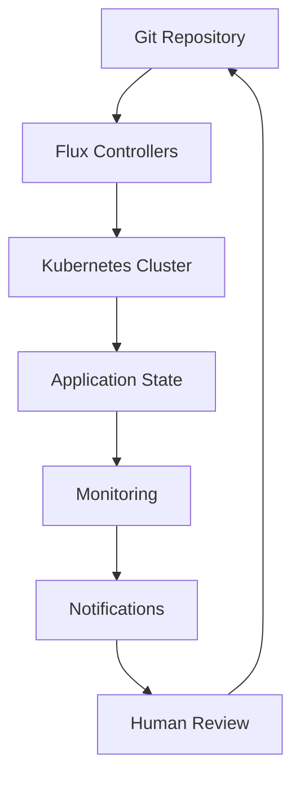

# GitOps Documentation

Comprehensive guide to InfraFlux GitOps workflows using Flux.

## 📋 Documentation Index

### Getting Started
- [GitOps Overview](OVERVIEW.md) - Understanding GitOps principles
- [Flux Setup](FLUX_SETUP.md) - Bootstrap Flux in your cluster
- [First Application](FIRST_APPLICATION.md) - Deploy your first app via GitOps

### Workflow Guides
- [Application Deployment](APPLICATION_DEPLOYMENT.md) - HelmRelease workflow
- [Environment Management](ENVIRONMENT_MANAGEMENT.md) - Staging vs Production
- [Image Automation](IMAGE_AUTOMATION.md) - Automated container updates
- [Secret Management](SECRET_MANAGEMENT.md) - GitOps-compatible secrets

### Advanced Topics
- [Multi-Environment](MULTI_ENVIRONMENT.md) - Complex environment setups
- [Notifications](NOTIFICATIONS.md) - Deployment status alerts
- [Rollback Procedures](ROLLBACKS.md) - Handling deployment failures
- [Custom Resources](CUSTOM_RESOURCES.md) - Managing CRDs and operators

### Reference
- [Flux Commands](FLUX_COMMANDS.md) - Common CLI operations
- [Kustomization Patterns](KUSTOMIZATION_PATTERNS.md) - Best practices
- [Troubleshooting](TROUBLESHOOTING.md) - Common issues and solutions

## 🔄 GitOps Workflow Overview

InfraFlux uses **Flux v2** for GitOps automation:



### Key Components

| Component | Purpose | Files |
|-----------|---------|-------|
| **Apps** | Application definitions | `apps/base/`, `apps/production/` |
| **Infrastructure** | Infrastructure components | `infrastructure/controllers/` |
| **Clusters** | Bootstrap configuration | `clusters/production/` |
| **Environments** | Environment policies | `environments/production/` |

## 🚀 Quick Commands

### Deployment Status
```bash
# View all Flux resources
flux get all

# Check specific application
flux get helmreleases -n applications

# View logs
flux logs --all-namespaces
```

### Manual Operations
```bash
# Force reconciliation
flux reconcile kustomization apps

# Suspend automation
flux suspend kustomization apps

# Resume automation
flux resume kustomization apps
```

## 🎯 Best Practices

### 1. **Environment Separation**
- Use overlays for environment-specific configurations
- Implement proper dependency ordering
- Apply security policies per environment

### 2. **Application Lifecycle**
- Start with HelmReleases for new applications
- Use semantic versioning for updates
- Implement proper health checks

### 3. **Security**
- Use Sealed Secrets for sensitive data
- Implement RBAC for Flux controllers
- Regular security scanning and updates

### 4. **Monitoring**
- Monitor Flux controller health
- Set up deployment notifications
- Track application performance metrics

## 🔗 Integration with Ansible

InfraFlux uses a **hybrid approach**:

- **Ansible**: Deploys cluster infrastructure and Flux itself
- **Flux**: Manages application lifecycle and updates

This provides the reliability of Ansible with the agility of GitOps.