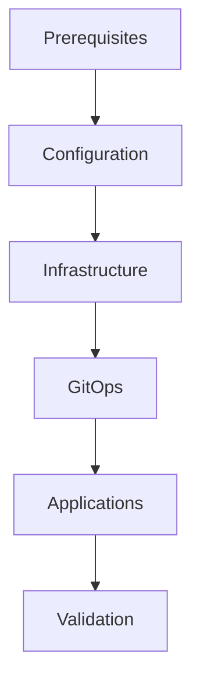

# InfraFlux v2.0: Deployment System Architecture Plan

> **Phase 2 - High Priority**: Automated deployment pipeline with one-command execution and comprehensive validation

---

## 🎯 **Strategic Overview**

This document defines the automated deployment system for InfraFlux v2.0, creating a unified, intelligent deployment pipeline that orchestrates the entire infrastructure lifecycle from VM creation to application deployment through a single command interface with comprehensive error handling, progress monitoring, and rollback capabilities.

### **Core Deployment Principles**

1. **One-Command Deployment**: Single entry point for complete infrastructure deployment
2. **Phase-Based Execution**: Logical phases with dependencies and validation gates
3. **Intelligent Error Handling**: Automatic recovery and rollback capabilities
4. **Progress Transparency**: Real-time status updates and detailed logging
5. **Validation-First**: Comprehensive pre and post deployment validation

---

## 📋 **Implementation Tasks Overview**

**Total Tasks**: 16 (5-6 per major component)
**Priority**: High (Phase 2)
**Timeline**: Week 3-4
**Dependencies**: Talos Architecture, Configuration Management

---

## 🚀 **Component 1: One-Command Deployment**

### **1.1 Smart Deployment Orchestration** (Task 1-3)

#### **Task 1.1.1: Master Deployment Script**
- **Priority**: Critical
- **Dependencies**: Talos Architecture complete
- **Deliverable**: `deploy.sh` - Unified deployment entry point
- **Description**: Intelligent deployment orchestrator that manages entire infrastructure lifecycle
- **Validation**: Deploys complete infrastructure with single command
- **Implementation**:
  ```bash
  #!/bin/bash
  # deploy.sh - InfraFlux v2.0 Unified Deployment System
  
  set -euo pipefail
  
  # Script metadata
  readonly SCRIPT_DIR="$(cd "$(dirname "${BASH_SOURCE[0]}")" && pwd)"
  readonly INFRAFLUX_VERSION="2.0.0"
  readonly DEPLOYMENT_ID="infraflux-$(date +%Y%m%d-%H%M%S)"
  
  # Configuration
  readonly CONFIG_FILE="${1:-config/cluster-config.yaml}"
  readonly DEPLOYMENT_PHASE="${2:-all}"
  readonly WORK_DIR="/tmp/infraflux-${DEPLOYMENT_ID}"
  readonly LOG_FILE="${WORK_DIR}/deployment.log"
  
  # Colors and formatting
  readonly RED='\033[0;31m'
  readonly GREEN='\033[0;32m'
  readonly YELLOW='\033[1;33m'
  readonly BLUE='\033[0;34m'
  readonly PURPLE='\033[0;35m'
  readonly CYAN='\033[0;36m'
  readonly WHITE='\033[1;37m'
  readonly NC='\033[0m'
  readonly BOLD='\033[1m'
  
  # State tracking
  declare -a COMPLETED_PHASES=()
  declare -a FAILED_PHASES=()
  declare -i START_TIME
  declare -i PHASE_START_TIME
  
  # Logging functions
  log() {
    local timestamp=$(date '+%Y-%m-%d %H:%M:%S')
    echo -e "${BLUE}[${timestamp}]${NC} $1" | tee -a "${LOG_FILE}"
  }
  
  success() {
    local timestamp=$(date '+%Y-%m-%d %H:%M:%S')
    echo -e "${GREEN}[${timestamp}] ✅${NC} $1" | tee -a "${LOG_FILE}"
  }
  
  warning() {
    local timestamp=$(date '+%Y-%m-%d %H:%M:%S')
    echo -e "${YELLOW}[${timestamp}] ⚠️${NC} $1" | tee -a "${LOG_FILE}"
  }
  
  error() {
    local timestamp=$(date '+%Y-%m-%d %H:%M:%S')
    echo -e "${RED}[${timestamp}] ❌${NC} $1" | tee -a "${LOG_FILE}"
  }
  
  # Progress tracking
  show_progress() {
    local phase="$1"
    local current="$2"
    local total="$3"
    local percentage=$((current * 100 / total))
    
    printf "\r${CYAN}[%s]${NC} Progress: [" "$phase"
    printf "%*s" $((percentage / 2)) | tr ' ' '='
    printf "%*s" $((50 - percentage / 2)) | tr ' ' '-'
    printf "] %d%% (%d/%d)" $percentage $current $total
  }
  
  # Banner display
  show_banner() {
    clear
    echo -e "${PURPLE}${BOLD}"
    cat << 'EOF'
  ██╗███╗   ██╗███████╗██████╗  █████╗ ███████╗██╗     ██╗   ██╗██╗  ██╗
  ██║████╗  ██║██╔════╝██╔══██╗██╔══██╗██╔════╝██║     ██║   ██║╚██╗██╔╝
  ██║██╔██╗ ██║█████╗  ██████╔╝███████║█████╗  ██║     ██║   ██║ ╚███╔╝ 
  ██║██║╚██╗██║██╔══╝  ██╔══██╗██╔══██║██╔══╝  ██║     ██║   ██║ ██╔██╗ 
  ██║██║ ╚████║██║     ██║  ██║██║  ██║██║     ███████╗╚██████╔╝██╔╝ ██╗
  ╚═╝╚═╝  ╚═══╝╚═╝     ╚═╝  ╚═╝╚═╝  ╚═╝╚═╝     ╚══════╝ ╚═════╝ ╚═╝  ╚═╝
  EOF
    echo -e "${NC}"
    echo -e "${WHITE}${BOLD}InfraFlux v${INFRAFLUX_VERSION} - Next-Generation Immutable Kubernetes Platform${NC}"
    echo -e "${CYAN}Built on Talos Linux with GitOps Automation${NC}"
    echo "=============================================================================="
    echo
  }
  
  # Phase execution framework
  execute_phase() {
    local phase_name="$1"
    local phase_script="$2"
    local phase_description="$3"
    
    PHASE_START_TIME=$(date +%s)
    
    log "🚀 Starting Phase: ${phase_name}"
    log "📋 Description: ${phase_description}"
    
    if [[ -f "${SCRIPT_DIR}/phases/${phase_script}" ]]; then
      if bash "${SCRIPT_DIR}/phases/${phase_script}" "${CONFIG_FILE}" "${WORK_DIR}"; then
        local phase_duration=$(($(date +%s) - PHASE_START_TIME))
        COMPLETED_PHASES+=("${phase_name}")
        success "Phase '${phase_name}' completed in ${phase_duration}s"
        return 0
      else
        local phase_duration=$(($(date +%s) - PHASE_START_TIME))
        FAILED_PHASES+=("${phase_name}")
        error "Phase '${phase_name}' failed after ${phase_duration}s"
        return 1
      fi
    else
      error "Phase script not found: ${phase_script}"
      return 1
    fi
  }
  
  # Deployment phases
  phase_prerequisites() {
    execute_phase "Prerequisites" "01-prerequisites.sh" "Verify system requirements and install dependencies"
  }
  
  phase_configuration() {
    execute_phase "Configuration" "02-configuration.sh" "Generate and validate all configurations"
  }
  
  phase_infrastructure() {
    execute_phase "Infrastructure" "03-infrastructure.sh" "Create VMs and bootstrap Talos cluster"
  }
  
  phase_gitops() {
    execute_phase "GitOps" "04-gitops.sh" "Bootstrap Flux and setup GitOps workflow"
  }
  
  phase_applications() {
    execute_phase "Applications" "05-applications.sh" "Deploy core applications and services"
  }
  
  phase_validation() {
    execute_phase "Validation" "06-validation.sh" "Comprehensive post-deployment validation"
  }
  
  # Main deployment orchestration
  main() {
    START_TIME=$(date +%s)
    
    # Setup
    mkdir -p "${WORK_DIR}"
    exec > >(tee -a "${LOG_FILE}")
    exec 2>&1
    
    show_banner
    
    log "🎯 Deployment ID: ${DEPLOYMENT_ID}"
    log "📁 Working Directory: ${WORK_DIR}"
    log "📝 Configuration: ${CONFIG_FILE}"
    log "🔄 Phase: ${DEPLOYMENT_PHASE}"
    
    # Deployment phases
    case "${DEPLOYMENT_PHASE}" in
      "all")
        phase_prerequisites || exit 1
        phase_configuration || exit 1
        phase_infrastructure || exit 1
        phase_gitops || exit 1
        phase_applications || exit 1
        phase_validation || exit 1
        ;;
      "prerequisites")
        phase_prerequisites || exit 1
        ;;
      "configuration")
        phase_configuration || exit 1
        ;;
      "infrastructure")
        phase_infrastructure || exit 1
        ;;
      "gitops")
        phase_gitops || exit 1
        ;;
      "applications")
        phase_applications || exit 1
        ;;
      "validation")
        phase_validation || exit 1
        ;;
      *)
        error "Invalid phase: ${DEPLOYMENT_PHASE}"
        show_help
        exit 1
        ;;
    esac
    
    # Success summary
    local total_duration=$(($(date +%s) - START_TIME))
    success "🎉 InfraFlux v2.0 deployment completed successfully!"
    log "⏱️  Total duration: ${total_duration}s"
    log "✅ Completed phases: ${COMPLETED_PHASES[*]}"
    
    if [[ ${#FAILED_PHASES[@]} -gt 0 ]]; then
      warning "❌ Failed phases: ${FAILED_PHASES[*]}"
    fi
    
    show_cluster_info
  }
  
  # Execute main function
  main "$@"
  ```

#### **Task 1.1.2: Phase Management System**
- **Priority**: Critical
- **Dependencies**: Task 1.1.1
- **Deliverable**: `phases/` directory with modular phase scripts
- **Description**: Modular phase system allowing selective execution and testing
- **Validation**: Each phase can be executed independently

#### **Task 1.1.3: Deployment State Management**
- **Priority**: High
- **Dependencies**: Task 1.1.2
- **Deliverable**: State tracking and resumption capability
- **Description**: Track deployment state and enable resumption from failed phases
- **Validation**: Deployment can resume from any failed phase

### **1.2 Progress Monitoring and Feedback** (Task 4-6)

#### **Task 1.2.1: Real-Time Progress Tracking**
- **Priority**: High
- **Dependencies**: Task 1.1.1
- **Deliverable**: Progress visualization system with percentage completion
- **Description**: Real-time progress bars and status updates for user feedback
- **Validation**: Progress accurately reflects deployment status

#### **Task 1.2.2: Detailed Logging System**
- **Priority**: High
- **Dependencies**: Task 1.2.1
- **Deliverable**: Comprehensive logging with multiple verbosity levels
- **Description**: Structured logging with timestamps, levels, and context
- **Validation**: Logs provide sufficient detail for troubleshooting

#### **Task 1.2.3: Status Dashboard**
- **Priority**: Medium
- **Dependencies**: Task 1.2.2
- **Deliverable**: Web-based deployment status dashboard
- **Description**: Optional web interface for monitoring deployment progress
- **Validation**: Dashboard shows real-time deployment status

### **1.3 Error Handling and Recovery** (Task 7-8)

#### **Task 1.3.1: Intelligent Error Recovery**
- **Priority**: Critical
- **Dependencies**: Task 1.1.3
- **Deliverable**: Automatic error detection and recovery procedures
- **Description**: Detect common errors and automatically attempt recovery
- **Validation**: Common failure scenarios recover automatically

#### **Task 1.3.2: Rollback Procedures**
- **Priority**: Critical
- **Dependencies**: Task 1.3.1
- **Deliverable**: Automated rollback system for failed deployments
- **Description**: Clean rollback capability that restores previous state
- **Validation**: Rollback restores system to pre-deployment state

---

## 🔧 **Component 2: Automation Pipeline**

### **2.1 Configuration Validation** (Task 9-10)

#### **Task 2.1.1: Pre-Deployment Validation**
- **Priority**: Critical
- **Dependencies**: Configuration Management system
- **Deliverable**: `scripts/validate-config.py`
- **Description**: Comprehensive validation of all configurations before deployment
- **Validation**: Invalid configurations caught before any changes made
- **Implementation**:
  ```python
  #!/usr/bin/env python3
  # scripts/validate-config.py
  
  import yaml
  import sys
  import ipaddress
  import re
  from pathlib import Path
  from typing import Dict, List, Any, Optional
  
  class ConfigValidator:
      def __init__(self, config_path: str):
          self.config_path = Path(config_path)
          self.config = self._load_config()
          self.errors = []
          self.warnings = []
      
      def _load_config(self) -> Dict[str, Any]:
          try:
              with open(self.config_path, 'r') as f:
                  return yaml.safe_load(f)
          except Exception as e:
              print(f"❌ Failed to load config: {e}")
              sys.exit(1)
      
      def validate_network_config(self) -> bool:
          """Validate network configuration"""
          data = self.config.get('data', {})
          
          # Validate CIDR blocks
          for cidr_key in ['pod_subnets', 'service_subnets']:
              if cidr_key in data:
                  for cidr in data[cidr_key]:
                      try:
                          ipaddress.ip_network(cidr, strict=False)
                      except ValueError:
                          self.errors.append(f"Invalid CIDR: {cidr}")
          
          # Validate IP addresses
          for ip_key in ['control_plane_ips', 'worker_ips']:
              if ip_key in data:
                  for ip in data[ip_key]:
                      try:
                          ipaddress.ip_address(ip)
                      except ValueError:
                          self.errors.append(f"Invalid IP address: {ip}")
          
          return len(self.errors) == 0
      
      def validate_resource_limits(self) -> bool:
          """Validate resource configuration"""
          data = self.config.get('data', {})
          
          # VM resources
          vm_memory = data.get('vm_memory', 0)
          if vm_memory < 2048:
              self.warnings.append("VM memory < 2GB may cause issues")
          
          vm_cores = data.get('vm_cores', 0)
          if vm_cores < 2:
              self.warnings.append("VM cores < 2 may cause performance issues")
          
          # Node counts
          control_plane_count = len(data.get('control_plane_ips', []))
          if control_plane_count % 2 == 0:
              self.errors.append("Control plane count must be odd for HA")
          
          return len(self.errors) == 0
      
      def validate_talos_config(self) -> bool:
          """Validate Talos-specific configuration"""
          data = self.config.get('data', {})
          
          # Talos version
          talos_version = data.get('talos_version', '')
          if not re.match(r'^v\d+\.\d+\.\d+$', talos_version):
              self.errors.append(f"Invalid Talos version format: {talos_version}")
          
          # Kubernetes version
          k8s_version = data.get('kubernetes_version', '')
          if not re.match(r'^v\d+\.\d+\.\d+$', k8s_version):
              self.errors.append(f"Invalid Kubernetes version format: {k8s_version}")
          
          return len(self.errors) == 0
      
      def validate_proxmox_config(self) -> bool:
          """Validate Proxmox configuration"""
          data = self.config.get('data', {})
          
          required_fields = ['proxmox_host', 'proxmox_user', 'proxmox_node']
          for field in required_fields:
              if not data.get(field):
                  self.errors.append(f"Missing required field: {field}")
          
          return len(self.errors) == 0
      
      def validate_all(self) -> bool:
          """Run all validations"""
          validations = [
              self.validate_network_config,
              self.validate_resource_limits,
              self.validate_talos_config,
              self.validate_proxmox_config
          ]
          
          success = True
          for validation in validations:
              if not validation():
                  success = False
          
          return success
      
      def print_results(self):
          """Print validation results"""
          if self.errors:
              print("❌ Configuration Errors:")
              for error in self.errors:
                  print(f"   - {error}")
          
          if self.warnings:
              print("⚠️  Configuration Warnings:")
              for warning in self.warnings:
                  print(f"   - {warning}")
          
          if not self.errors and not self.warnings:
              print("✅ Configuration validation passed")
          elif not self.errors:
              print("✅ Configuration validation passed with warnings")
  
  def main():
      if len(sys.argv) != 2:
          print("Usage: validate-config.py <config-file>")
          sys.exit(1)
      
      validator = ConfigValidator(sys.argv[1])
      success = validator.validate_all()
      validator.print_results()
      
      sys.exit(0 if success else 1)
  
  if __name__ == "__main__":
      main()
  ```

#### **Task 2.1.2: Dependency Verification**
- **Priority**: High
- **Dependencies**: Task 2.1.1
- **Deliverable**: Verification of all external dependencies and requirements
- **Description**: Check Proxmox connectivity, required tools, network accessibility
- **Validation**: All dependencies verified before deployment starts

### **2.2 Infrastructure Provisioning** (Task 11-12)

#### **Task 2.2.1: Terraform Automation**
- **Priority**: Critical
- **Dependencies**: Task 2.1.2
- **Deliverable**: Automated Terraform workflow with state management
- **Description**: Fully automated Terraform execution with proper state handling
- **Validation**: Infrastructure provisions reliably without manual intervention

#### **Task 2.2.2: VM Readiness Verification**
- **Priority**: High
- **Dependencies**: Task 2.2.1
- **Deliverable**: Comprehensive VM health checking before cluster bootstrap
- **Description**: Verify VMs are accessible and ready for Talos installation
- **Validation**: Only proceed to cluster bootstrap when all VMs are ready

### **2.3 Cluster Initialization** (Task 13-14)

#### **Task 2.3.1: Talos Cluster Bootstrap Automation**
- **Priority**: Critical
- **Dependencies**: Task 2.2.2
- **Deliverable**: Fully automated Talos cluster bootstrap process
- **Description**: Bootstrap Talos cluster with proper sequencing and validation
- **Validation**: Cluster achieves ready state with all nodes joined

#### **Task 2.3.2: Core Component Installation**
- **Priority**: High
- **Dependencies**: Task 2.3.1
- **Deliverable**: Automated installation of core components (Cilium, cert-manager, etc.)
- **Description**: Deploy essential cluster components before GitOps takes over
- **Validation**: All core components healthy before GitOps bootstrap

### **2.4 Application Deployment** (Task 15-16)

#### **Task 2.4.1: GitOps Bootstrap Integration**
- **Priority**: Critical
- **Dependencies**: Task 2.3.2
- **Deliverable**: Seamless transition from infrastructure to GitOps management
- **Description**: Bootstrap Flux and transition to GitOps-managed deployments
- **Validation**: GitOps system takes over application management

#### **Task 2.4.2: Application Health Verification**
- **Priority**: High
- **Dependencies**: Task 2.4.1
- **Deliverable**: Comprehensive application health checking post-deployment
- **Description**: Verify all deployed applications are healthy and accessible
- **Validation**: All applications pass health checks and are accessible

---

## 🧪 **Component 3: Quality Assurance**

### **3.1 Pre-Deployment Checks** (Task 17-18)

#### **Task 3.1.1: Environment Validation**
- **Priority**: Critical
- **Dependencies**: None
- **Deliverable**: Complete environment validation before any deployment
- **Description**: Validate host system, network, and all prerequisites
- **Validation**: Environment meets all requirements for successful deployment

#### **Task 3.1.2: Configuration Compatibility Check**
- **Priority**: High
- **Dependencies**: Task 3.1.1
- **Deliverable**: Cross-validation of all configuration elements
- **Description**: Ensure all configurations are compatible and consistent
- **Validation**: No configuration conflicts detected

### **3.2 Post-Deployment Validation** (Task 19-20)

#### **Task 3.2.1: Cluster Health Assessment**
- **Priority**: Critical
- **Dependencies**: All deployment phases
- **Deliverable**: Comprehensive cluster health evaluation
- **Description**: Validate cluster functionality, performance, and security
- **Validation**: Cluster meets all operational requirements

#### **Task 3.2.2: Performance Benchmarking**
- **Priority**: Medium
- **Dependencies**: Task 3.2.1
- **Deliverable**: Performance baseline establishment and validation
- **Description**: Run performance tests and establish operational baselines
- **Validation**: Performance meets expected thresholds

---

## 🔧 **Technical Specifications**

### **Deployment Architecture**
- **Orchestrator**: Bash-based with Python validation components
- **State Management**: File-based state tracking with JSON metadata
- **Logging**: Structured logging with multiple output formats
- **Progress Tracking**: Real-time progress indication with ETA calculation

### **Phase Dependencies**


### **Error Handling Levels**
1. **Warning**: Continue with warning notification
2. **Error**: Stop phase execution, attempt recovery
3. **Fatal**: Stop deployment, initiate rollback
4. **Panic**: Emergency stop, manual intervention required

### **Rollback Strategies**
- **Infrastructure**: Terraform destroy and state cleanup
- **Configuration**: Restore previous configuration version
- **Applications**: GitOps revert to previous commit
- **Full System**: Complete environment restoration

---

## 📊 **Success Criteria**

### **Functional Requirements**
- ✅ Single command deploys complete infrastructure
- ✅ All phases execute in correct order with proper dependencies
- ✅ Failed deployments can be resumed from last successful phase
- ✅ Rollback procedures restore previous state correctly
- ✅ Progress feedback provides clear status to users

### **Performance Requirements**
- ✅ Total deployment time < 20 minutes for standard cluster
- ✅ Configuration validation < 30 seconds
- ✅ Phase transition time < 10 seconds
- ✅ Error detection time < 5 seconds

### **Reliability Requirements**
- ✅ Deployment success rate > 95% with valid configuration
- ✅ Error recovery success rate > 80% for transient issues
- ✅ Rollback success rate > 99% for all scenarios
- ✅ State consistency maintained across all failure scenarios

### **Usability Requirements**
- ✅ Clear progress indication throughout deployment
- ✅ Meaningful error messages with actionable guidance
- ✅ Deployment logs provide sufficient debugging information
- ✅ Help system provides clear usage instructions

---

## 🚀 **Integration Points**

### **With Talos Architecture**
- Orchestrates Talos cluster bootstrap
- Manages Talos configuration deployment
- Validates Talos cluster health

### **With Configuration Management**
- Uses master configuration as single source of truth
- Validates configuration before deployment
- Generates all required configurations

### **With GitOps Workflow**
- Bootstraps Flux GitOps system
- Transitions from imperative to declarative management
- Validates GitOps functionality

### **With Security Framework**
- Implements security validation checkpoints
- Ensures proper RBAC and policies applied
- Validates security posture post-deployment

---

## 🎯 **Next Steps**

Upon completion of this Deployment System implementation:

1. **User Experience**: Create intuitive CLI interface with help system
2. **Advanced Features**: Add parallel deployment capabilities
3. **Cloud Integration**: Extend to cloud providers beyond Proxmox
4. **Monitoring Integration**: Add deployment metrics and telemetry
5. **Documentation**: Create comprehensive deployment guides

This deployment system provides the automated, reliable, and user-friendly deployment experience required for InfraFlux v2.0's next-generation platform.