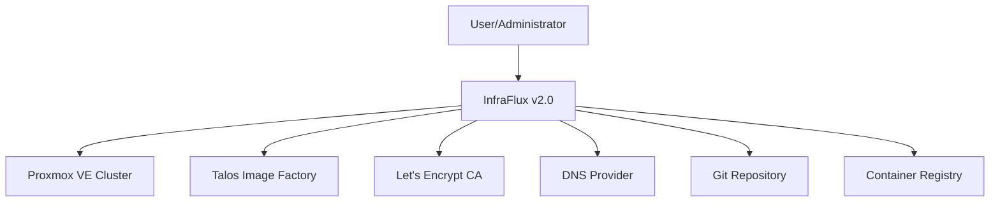
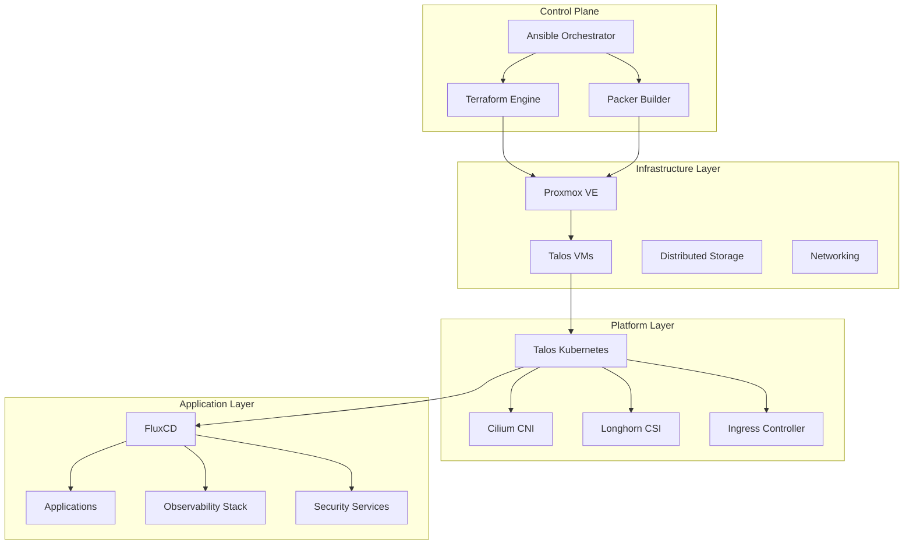
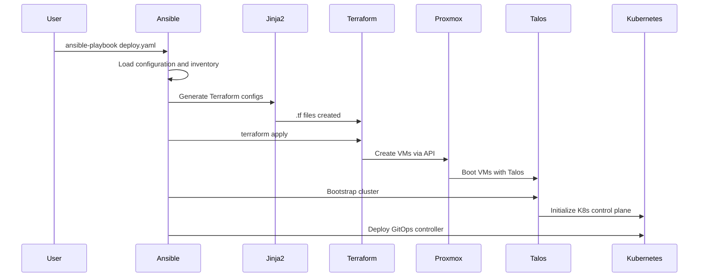
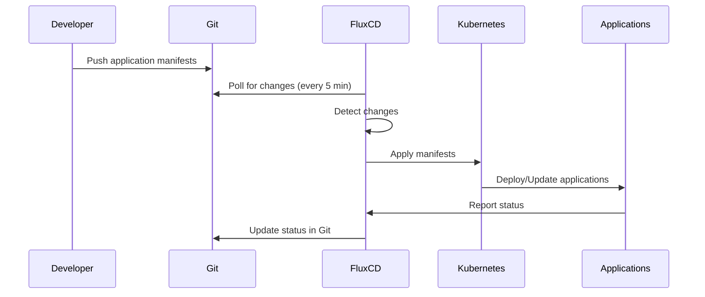
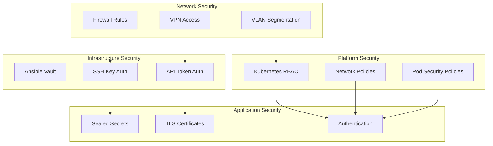
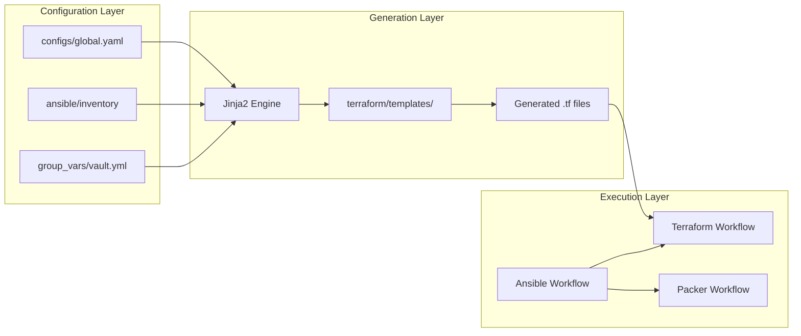
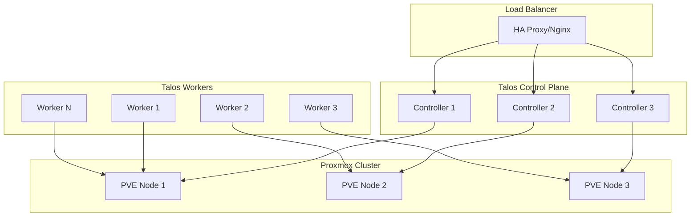

# InfraFlux v2.0 System Architecture Specification

## Overview

InfraFlux v2.0 is a comprehensive infrastructure automation system that orchestrates the deployment and management of Talos Kubernetes clusters on Proxmox virtual environments. The system emphasizes declarative configuration, automated operations, and GitOps-driven application deployment.

## Architecture Principles

### Core Design Principles

1. **Declarative Configuration**: Users define desired state; system applies changes
2. **Immutable Infrastructure**: Infrastructure components are replaced rather than modified
3. **Single Source of Truth**: All configuration stored in version control
4. **Fail-Safe Operations**: System prioritizes safety over speed
5. **Automated Recovery**: Self-healing capabilities where possible

### Quality Attributes

- **Reliability**: 99.9% successful deployment rate
- **Performance**: < 30 minutes for full cluster deployment
- **Security**: Defense in depth with multiple security layers
- **Maintainability**: Modular, well-documented, testable components
- **Scalability**: Support for 3-100 node clusters

## System Context

### External Dependencies



### System Boundaries

**Within System Boundary**:
- Ansible orchestration engine
- Terraform infrastructure provisioning
- Packer image management
- Talos cluster configuration
- GitOps workflow management
- Monitoring and observability stack

**Outside System Boundary**:
- Proxmox hypervisor platform
- External DNS services
- Container image registries
- Certificate authorities
- Git hosting services

## Component Architecture

### High-Level Architecture



### Component Responsibilities

| Component | Primary Responsibility | Key Technologies |
|-----------|----------------------|------------------|
| **Ansible Orchestrator** | Workflow coordination, configuration management | Ansible, Jinja2, YAML |
| **Terraform Engine** | Infrastructure provisioning, state management | Terraform, Proxmox Provider |
| **Packer Builder** | VM template creation and management | Packer, Cloud-init |
| **Talos Kubernetes** | Container orchestration platform | Talos Linux, Kubernetes |
| **FluxCD** | GitOps continuous deployment | FluxCD, Kustomize, Helm |
| **Security Services** | Certificate management, secrets, RBAC | cert-manager, Sealed Secrets |
| **Observability Stack** | Monitoring, logging, alerting | Prometheus, Grafana, Loki |

## Data Flow Architecture

### Configuration Flow



### GitOps Application Deployment



## Security Architecture

### Security Layers



### Security Implementation

| Security Layer | Implementation | Technologies |
|----------------|----------------|-------------|
| **Secrets Management** | Dual-layer approach | Ansible Vault + Sealed Secrets |
| **Network Security** | Firewall, VLANs, network policies | iptables, Cilium Network Policies |
| **Access Control** | RBAC, least privilege | Kubernetes RBAC, Authentik OIDC |
| **Certificate Management** | Automated TLS certificates | cert-manager, Let's Encrypt |
| **Image Security** | Signed images, vulnerability scanning | Harbor, Trivy |

## Integration Architecture

### Tool Integration Patterns



### State Management

| Component | State Storage | Backup Strategy |
|-----------|---------------|----------------|
| **Terraform** | Remote backend (S3/GCS) | Automated daily backups |
| **Ansible** | Git repository | Version control history |
| **Kubernetes** | etcd cluster | Automated etcd backups |
| **Configuration** | Git repository | Branch protection, PR reviews |

## Scalability Architecture

### Scaling Dimensions

1. **Horizontal Scaling**: Add more worker nodes to clusters
2. **Vertical Scaling**: Increase resources per node
3. **Multi-Cluster**: Deploy multiple independent clusters
4. **Multi-Tenant**: Isolated workloads within clusters

### Resource Allocation Patterns

```yaml
# Example scaling configuration
clusters:
  development:
    control_plane_nodes: 1
    worker_nodes: 2
    resources_per_node:
      cpu: 4
      memory: 8GB
      
  production:
    control_plane_nodes: 3
    worker_nodes: 6
    resources_per_node:
      cpu: 8
      memory: 16GB
```

## Deployment Architecture

### Deployment Topology



### High Availability Design

- **Control Plane**: 3+ nodes with etcd quorum
- **Worker Nodes**: Distributed across Proxmox nodes
- **Storage**: Replicated across multiple nodes
- **Networking**: Redundant network paths
- **Load Balancing**: External load balancer for API access

## Operational Architecture

### Day-0 Operations (Initial Deployment)

1. **Pre-flight Checks**: Validate prerequisites and connectivity
2. **Image Preparation**: Download and prepare Talos images
3. **Infrastructure Provisioning**: Create VMs and networking
4. **Cluster Bootstrap**: Initialize Kubernetes cluster
5. **Platform Services**: Deploy core platform components
6. **GitOps Bootstrap**: Initialize continuous deployment

### Day-1 Operations (Configuration)

1. **Application Deployment**: Deploy workloads via GitOps
2. **User Onboarding**: Create namespaces and RBAC
3. **Certificate Provisioning**: Issue TLS certificates
4. **Monitoring Setup**: Configure observability stack
5. **Backup Configuration**: Set up automated backups

### Day-2 Operations (Maintenance)

1. **Scaling Operations**: Add/remove nodes and resources
2. **Update Management**: Rolling updates for OS and K8s
3. **Backup Management**: Regular backup and restore testing
4. **Performance Optimization**: Resource tuning and optimization
5. **Security Management**: Certificate renewal, security updates

## Quality Attributes Implementation

### Reliability

- **Redundancy**: Multiple replicas of critical components
- **Health Checks**: Comprehensive monitoring and alerting
- **Graceful Degradation**: System continues operating with reduced functionality
- **Automated Recovery**: Self-healing for common failure scenarios

### Performance

- **Resource Optimization**: Right-sized resource allocation
- **Efficient Networking**: High-performance CNI with eBPF
- **Storage Performance**: Fast persistent storage with caching
- **Monitoring**: Performance metrics and optimization

### Security

- **Defense in Depth**: Multiple security layers
- **Least Privilege**: Minimal required permissions
- **Encryption**: Data encryption at rest and in transit
- **Audit Logging**: Comprehensive security event logging

### Maintainability

- **Modular Design**: Loosely coupled, highly cohesive components
- **Documentation**: Comprehensive documentation and examples
- **Testing**: Automated testing at multiple levels
- **Monitoring**: Observability into system behavior

## Technology Stack Rationale

### Core Technology Decisions

| Technology | Rationale | Alternatives Considered |
|------------|-----------|------------------------|
| **Talos Linux** | Immutable, API-driven, secure | Ubuntu, CentOS, K3OS |
| **Proxmox** | Open source, mature, KVM-based | VMware, Hyper-V, OpenStack |
| **Ansible** | Agentless, YAML-based, mature | Puppet, Chef, SaltStack |
| **Terraform** | Declarative, state management | Pulumi, CloudFormation |
| **FluxCD** | Kubernetes-native, simple | ArgoCD, Jenkins |
| **Cilium** | eBPF-based, high performance | Calico, Flannel |
| **Longhorn** | Cloud-native, backup features | Rook/Ceph, OpenEBS |

### Architecture Trade-offs

| Decision | Benefits | Trade-offs |
|----------|----------|------------|
| **Monorepo Structure** | Atomic changes, simplified CI/CD | Larger repository, access control |
| **Dynamic TF Generation** | Flexibility, DRY principle | Complexity, debugging difficulty |
| **Dual Secrets Management** | Layer separation, GitOps friendly | Two different workflows |
| **Immutable Infrastructure** | Consistency, security | Longer deployment times |

## Future Architecture Considerations

### Planned Enhancements

1. **Multi-Cloud Support**: Extend beyond Proxmox to public clouds
2. **Advanced Networking**: Service mesh integration (Istio/Linkerd)
3. **AI/ML Workloads**: GPU support and ML operator integration
4. **Edge Computing**: Lightweight edge node deployment
5. **Disaster Recovery**: Cross-datacenter replication

### Architecture Evolution

- **Version 2.0**: Current architecture as specified
- **Version 2.1**: Enhanced observability and automation
- **Version 2.2**: Multi-cloud and advanced networking
- **Version 3.0**: AI/ML platform and edge computing

The architecture is designed to evolve incrementally while maintaining backward compatibility and operational stability.