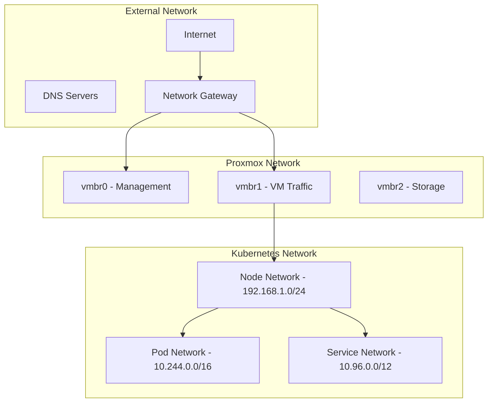
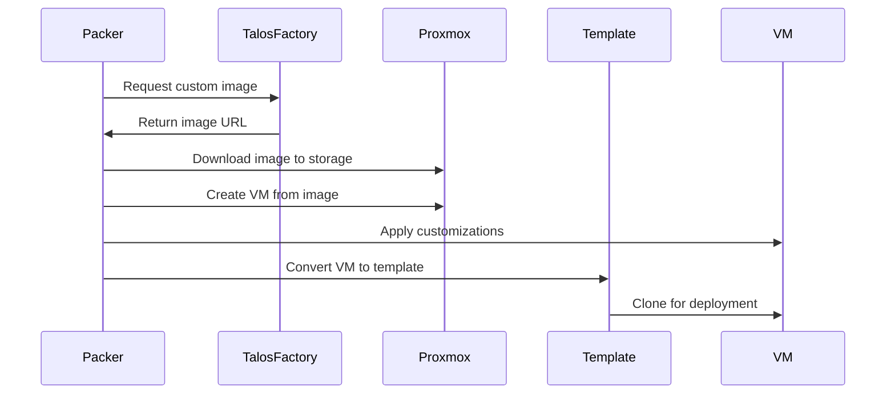

# InfraFlux v2.0 Infrastructure Specification

## Overview

This document specifies the infrastructure requirements, design patterns, and implementation details for deploying InfraFlux v2.0 on Proxmox Virtual Environment (PVE). The infrastructure layer provides the foundation for Talos Kubernetes clusters with emphasis on reliability, performance, and operational efficiency.

## Proxmox Infrastructure Requirements

### Minimum Hardware Requirements

#### Development Environment (Single Node)
```yaml
proxmox_node:
  cpu: 16 cores
  memory: 64 GB RAM
  storage: 1 TB NVMe SSD
  network: 1 Gbps connection
  
kubernetes_cluster:
  control_plane: 1 node (4 cores, 8 GB RAM)
  workers: 2 nodes (4 cores, 8 GB RAM each)
  total_overhead: 24 cores, 24 GB RAM
```

#### Production Environment (Multi-Node)
```yaml
proxmox_cluster:
  minimum_nodes: 3
  recommended_nodes: 5+
  
per_node_requirements:
  cpu: 32+ cores
  memory: 128+ GB RAM
  storage: 2+ TB NVMe SSD
  network: 10 Gbps connection
  
kubernetes_cluster:
  control_plane: 3 nodes (8 cores, 16 GB RAM each)
  workers: 6+ nodes (16 cores, 32 GB RAM each)
  total_capacity: scalable based on workload requirements
```

### Proxmox Version Compatibility

| Proxmox VE Version | Support Status | Notes |
|-------------------|----------------|-------|
| 8.0+ | Fully Supported | Recommended version |
| 7.4+ | Supported | Minimum required version |
| 7.0-7.3 | Limited Support | Upgrade recommended |
| < 7.0 | Not Supported | Must upgrade |

### Required Proxmox Features

#### Core Features
- **API Access**: REST API enabled with proper authentication
- **Cloud-init Support**: For automated VM configuration
- **QEMU Guest Agent**: VM status reporting and control
- **Backup Capabilities**: VM backup and restore functionality
- **Network Management**: Bridge and VLAN configuration

#### Storage Requirements
```yaml
storage_types:
  primary:
    type: local-lvm
    use_case: VM disks and container storage
    performance: high-speed NVMe preferred
    
  backup:
    type: directory or NFS
    use_case: VM backups and templates
    performance: standard spinning disks acceptable
    
  templates:
    type: local or shared
    use_case: VM templates and ISO images
    performance: standard storage acceptable
```

## Network Architecture

### Network Topology



### Network Configuration

#### Bridge Configuration
```yaml
bridges:
  vmbr0:
    description: "Management and API access"
    physical_interface: "enp0s3"
    ip_range: "192.168.0.0/24"
    vlan_aware: false
    
  vmbr1:
    description: "VM and Kubernetes traffic"
    physical_interface: "enp0s8"
    ip_range: "192.168.1.0/24"
    vlan_aware: true
    vlans: [100, 200, 300]
    
  vmbr2:
    description: "Storage and backup traffic"
    physical_interface: "enp0s9"
    ip_range: "192.168.2.0/24"
    vlan_aware: false
```

#### VLAN Configuration (Optional)
```yaml
vlans:
  management:
    id: 100
    description: "Management traffic"
    subnet: "192.168.100.0/24"
    
  production:
    id: 200
    description: "Production workloads"
    subnet: "192.168.200.0/24"
    
  development:
    id: 300
    description: "Development workloads"
    subnet: "192.168.300.0/24"
```

#### IP Address Allocation

| Network Segment | CIDR | Purpose | DHCP Range |
|-----------------|------|---------|------------|
| Management | 192.168.0.0/24 | Proxmox nodes, IPMI | .100-.199 |
| Kubernetes | 192.168.1.0/24 | Talos VMs | .50-.249 |
| Storage | 192.168.2.0/24 | Backup, NFS | .10-.50 |
| Load Balancer | 192.168.1.250/32 | HA Proxy VIP | Static |

## VM Template Specifications

### Talos VM Template Configuration

#### Base Template Specifications
```yaml
template_config:
  name: "talos-${talos_version}-template"
  os_type: "l26"  # Linux 6.x kernel
  cpu:
    type: "kvm64"
    cores: 2
    sockets: 1
  memory:
    size: 4096  # MB
    balloon: true
  
  disks:
    boot_disk:
      storage: "local-lvm"
      size: "20G"
      format: "raw"
      interface: "virtio0"
      
    data_disk:
      storage: "local-lvm"
      size: "50G"
      format: "raw"
      interface: "virtio1"
  
  network:
    interface: "virtio"
    bridge: "vmbr1"
    model: "virtio"
    firewall: true
```

#### Cloud-init Configuration
```yaml
cloud_init:
  user: "talos"
  ssh_keys:
    - "ssh-ed25519 AAAAC3NzaC1lZDI1NTE5AAAAIJzfFf..."
  
  network_config: |
    version: 2
    ethernets:
      eth0:
        dhcp4: true
        dhcp6: false
  
  user_data: |
    #cloud-config
    package_update: false
    package_upgrade: false
```

### Image Management Workflow



## Resource Allocation Patterns

### Node Sizing Guidelines

#### Control Plane Nodes
```yaml
control_plane:
  minimal:
    cpu: 2 cores
    memory: 4 GB
    disk: 20 GB
    use_case: "Development and testing"
    
  recommended:
    cpu: 4 cores
    memory: 8 GB
    disk: 50 GB
    use_case: "Production clusters < 50 nodes"
    
  high_availability:
    cpu: 8 cores
    memory: 16 GB
    disk: 100 GB
    use_case: "Production clusters > 50 nodes"
```

#### Worker Nodes
```yaml
workers:
  small:
    cpu: 4 cores
    memory: 8 GB
    disk: 50 GB
    use_case: "Light workloads, development"
    
  medium:
    cpu: 8 cores
    memory: 16 GB
    disk: 100 GB
    use_case: "General production workloads"
    
  large:
    cpu: 16 cores
    memory: 32 GB
    disk: 200 GB
    use_case: "Resource-intensive workloads"
    
  compute_optimized:
    cpu: 32 cores
    memory: 64 GB
    disk: 500 GB
    use_case: "CPU-intensive applications"
```

### Resource Planning Calculator

```python
# Example resource calculation
def calculate_cluster_resources(cluster_spec):
    control_nodes = cluster_spec['control_plane']['count']
    worker_nodes = cluster_spec['workers']['count']
    
    cp_resources = {
        'cpu': control_nodes * cluster_spec['control_plane']['cpu'],
        'memory': control_nodes * cluster_spec['control_plane']['memory'],
        'disk': control_nodes * cluster_spec['control_plane']['disk']
    }
    
    worker_resources = {
        'cpu': worker_nodes * cluster_spec['workers']['cpu'],
        'memory': worker_nodes * cluster_spec['workers']['memory'],
        'disk': worker_nodes * cluster_spec['workers']['disk']
    }
    
    total_resources = {
        'cpu': cp_resources['cpu'] + worker_resources['cpu'],
        'memory': cp_resources['memory'] + worker_resources['memory'],
        'disk': cp_resources['disk'] + worker_resources['disk']
    }
    
    # Add 20% overhead for system processes
    total_resources['cpu'] *= 1.2
    total_resources['memory'] *= 1.2
    total_resources['disk'] *= 1.1
    
    return total_resources
```

## Storage Architecture

### Storage Strategy

#### Primary Storage (VM Disks)
```yaml
primary_storage:
  type: "local-lvm"
  backing_device: "NVMe SSD"
  redundancy: "RAID 1 or RAID 10"
  performance: "High IOPS, low latency"
  use_cases:
    - VM boot disks
    - Kubernetes persistent volumes
    - Database storage
```

#### Secondary Storage (Backups)
```yaml
secondary_storage:
  type: "directory or NFS"
  backing_device: "SATA SSD or HDD"
  redundancy: "RAID 5 or RAID 6"
  performance: "Sequential throughput optimized"
  use_cases:
    - VM backups
    - Long-term data retention
    - Archive storage
```

### Longhorn Distributed Storage

#### Storage Class Configuration
```yaml
longhorn_storage_classes:
  fast:
    parameters:
      numberOfReplicas: "2"
      staleReplicaTimeout: "30"
      diskSelector: "nvme"
      nodeSelector: "storage=nvme"
    use_case: "High-performance workloads"
    
  balanced:
    parameters:
      numberOfReplicas: "3"
      staleReplicaTimeout: "60"
      diskSelector: "ssd"
    use_case: "General workloads"
    
  backup:
    parameters:
      numberOfReplicas: "2"
      staleReplicaTimeout: "300"
      recurringJobSelector: "backup"
    use_case: "Backup and archival"
```

#### Backup Strategy
```yaml
backup_configuration:
  local_snapshots:
    schedule: "0 */6 * * *"  # Every 6 hours
    retention: "48 hours"
    
  offsite_backups:
    schedule: "0 2 * * *"    # Daily at 2 AM
    retention: "30 days"
    destination: "S3 compatible storage"
    
  disaster_recovery:
    schedule: "0 1 * * 0"    # Weekly on Sunday
    retention: "12 weeks"
    destination: "Remote datacenter"
```

## High Availability Design

### Cluster Topology

#### Multi-Node HA Configuration
```yaml
ha_configuration:
  proxmox_cluster:
    minimum_nodes: 3
    quorum: "corosync"
    fencing: "IPMI/iLO"
    
  kubernetes_cluster:
    control_plane_nodes: 3
    distribution: "across_pve_nodes"
    load_balancer: "external_haproxy"
    
  storage_replication:
    longhorn_replicas: 3
    backup_sites: 2
```

#### Failure Scenarios and Recovery

| Failure Type | Impact | Recovery Time | Automated Recovery |
|--------------|--------|---------------|-------------------|
| Single VM | Minimal | < 5 minutes | Yes - Pod rescheduling |
| Proxmox Node | Partial | < 15 minutes | Yes - VM migration |
| Control Plane Node | None | < 10 minutes | Yes - etcd quorum |
| Network Partition | Variable | < 30 minutes | Partial - depends on split |
| Storage Failure | Data loss risk | < 60 minutes | Yes - replica promotion |

### Load Balancing

#### External Load Balancer Configuration
```yaml
load_balancer:
  type: "HAProxy or Nginx"
  deployment: "dedicated_vm"
  configuration:
    frontend:
      bind: "*:6443"
      mode: "tcp"
      
    backend:
      balance: "roundrobin"
      check: "check port 6443"
      servers:
        - "k8s-cp-1:6443"
        - "k8s-cp-2:6443"
        - "k8s-cp-3:6443"
```

## Performance Optimization

### CPU Configuration

#### CPU Pinning and NUMA
```yaml
cpu_optimization:
  control_plane:
    cpu_type: "host"
    numa: "enabled"
    pinning: "optional"
    
  workers:
    cpu_type: "host"
    numa: "enabled"
    pinning: "recommended_for_performance_workloads"
```

#### CPU Allocation Strategy
- **Control Plane**: Dedicated cores for consistency
- **Workers**: Shared cores with overcommit ratio 1:1.5
- **System**: Reserve 2-4 cores for Proxmox host OS

### Memory Configuration

#### Memory Allocation
```yaml
memory_optimization:
  ballooning: "disabled_for_kubernetes"
  hugepages: "enabled_for_performance_workloads"
  swap: "disabled_on_kubernetes_nodes"
  
  allocation_strategy:
    control_plane: "no_overcommit"
    workers: "minimal_overcommit_1.1"
    system_reserved: "8GB_minimum"
```

### Network Performance

#### Network Optimization
```yaml
network_optimization:
  virtio_queues: "multiqueue_enabled"
  mtu_size: "9000_for_storage_traffic"
  tcp_optimization: "bbr_congestion_control"
  
  bandwidth_allocation:
    management: "1 Gbps"
    kubernetes: "10 Gbps"
    storage: "10 Gbps"
```

## Security Considerations

### Network Security

#### Firewall Configuration
```yaml
firewall_rules:
  proxmox_api:
    port: 8006
    protocol: "https"
    source: "management_network"
    
  kubernetes_api:
    port: 6443
    protocol: "https"
    source: "cluster_network"
    
  ssh_access:
    port: 22
    protocol: "ssh"
    source: "management_network"
    key_only: true
```

#### Network Segmentation
- **Management VLAN**: Proxmox API, SSH access
- **Production VLAN**: Kubernetes workloads
- **Storage VLAN**: Backup and replication traffic
- **DMZ VLAN**: External-facing services

### Storage Security

#### Encryption Configuration
```yaml
encryption:
  at_rest:
    luks: "enabled_for_sensitive_data"
    longhorn: "encryption_enabled"
    
  in_transit:
    tls: "required_for_all_connections"
    vpn: "ipsec_for_cross_site_replication"
```

### Access Control

#### API Security
```yaml
api_security:
  proxmox:
    authentication: "api_tokens"
    authorization: "role_based"
    audit_logging: "enabled"
    
  kubernetes:
    authentication: "oidc_integration"
    authorization: "rbac"
    audit_logging: "enabled"
```

## Monitoring and Observability

### Infrastructure Metrics

#### Proxmox Monitoring
```yaml
proxmox_metrics:
  node_exporter: "system_metrics"
  pve_exporter: "proxmox_specific_metrics"
  
  key_metrics:
    - "cpu_utilization"
    - "memory_usage"
    - "disk_io"
    - "network_throughput"
    - "vm_status"
```

#### Kubernetes Infrastructure Metrics
```yaml
kubernetes_metrics:
  kubelet: "node_and_pod_metrics"
  cadvisor: "container_metrics"
  kube_state_metrics: "kubernetes_object_metrics"
  
  key_metrics:
    - "pod_cpu_memory_usage"
    - "persistent_volume_usage"
    - "network_policies"
    - "service_endpoints"
```

### Alerting Configuration

#### Critical Alerts
```yaml
critical_alerts:
  infrastructure:
    - "proxmox_node_down"
    - "vm_migration_failed"
    - "storage_space_critical"
    
  kubernetes:
    - "control_plane_down"
    - "etcd_cluster_unhealthy"
    - "persistent_volume_full"
```

## Operational Procedures

### Deployment Procedures

#### New Cluster Deployment
1. **Pre-flight Validation**: Check resource availability
2. **Template Preparation**: Update VM templates
3. **Infrastructure Provisioning**: Create VMs and networking
4. **Cluster Bootstrap**: Initialize Kubernetes
5. **Platform Services**: Deploy core services
6. **Validation Testing**: End-to-end functionality tests

#### Node Addition Procedure
1. **Capacity Planning**: Verify resource availability
2. **VM Creation**: Deploy new node VM
3. **Cluster Join**: Add node to Kubernetes cluster
4. **Workload Distribution**: Rebalance workloads
5. **Monitoring Setup**: Add node to monitoring

### Maintenance Procedures

#### Rolling Updates
```yaml
update_strategy:
  proxmox_nodes:
    method: "rolling_update"
    maintenance_window: "weekly_4_hour_window"
    
  kubernetes_nodes:
    method: "drain_and_update"
    max_unavailable: "25%"
    
  vm_templates:
    method: "blue_green_deployment"
    rollback_capability: "immediate"
```

#### Backup Procedures
```yaml
backup_procedures:
  proxmox_vms:
    schedule: "daily_incremental"
    retention: "30_days"
    compression: "lzo"
    
  kubernetes_data:
    etcd_backup: "every_6_hours"
    persistent_volumes: "daily_snapshots"
    configurations: "git_repository"
```

## Troubleshooting Guidelines

### Common Issues and Solutions

#### VM Performance Issues
```yaml
troubleshooting:
  cpu_contention:
    symptoms: "high_cpu_wait_times"
    investigation: "check_cpu_pinning_and_numa"
    solution: "adjust_cpu_allocation_or_pinning"
    
  memory_pressure:
    symptoms: "oom_kills_frequent_swapping"
    investigation: "check_memory_allocation_and_ballooning"
    solution: "increase_memory_or_adjust_limits"
    
  storage_latency:
    symptoms: "high_io_wait_disk_errors"
    investigation: "check_storage_health_and_load"
    solution: "optimize_storage_or_add_capacity"
```

#### Network Connectivity Issues
```yaml
network_troubleshooting:
  vm_connectivity:
    tools: ["ping", "traceroute", "nmap"]
    check: "bridge_configuration_and_firewall_rules"
    
  kubernetes_networking:
    tools: ["kubectl", "cilium", "hubble"]
    check: "cni_configuration_and_network_policies"
```

### Diagnostic Tools

#### Infrastructure Diagnostics
```bash
# Proxmox diagnostics
pvesh get /nodes/${node}/status
pvesh get /cluster/resources
qm list

# Network diagnostics
bridge link show
ip route show
iptables -L

# Storage diagnostics
pvesm status
lsblk
df -h
```

#### Kubernetes Diagnostics
```bash
# Cluster health
kubectl get nodes
kubectl get pods --all-namespaces
kubectl top nodes

# Storage diagnostics
kubectl get pv,pvc
kubectl get storageclass

# Network diagnostics
kubectl get svc,endpoints
cilium status
```

This infrastructure specification provides the foundation for reliable, scalable, and secure Kubernetes deployments on Proxmox Virtual Environment.