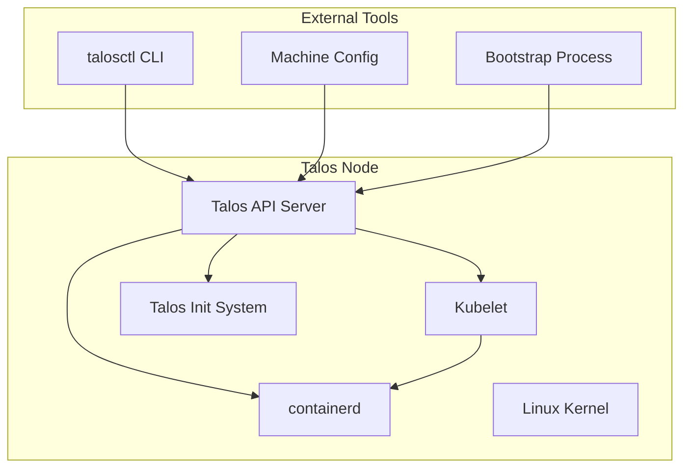
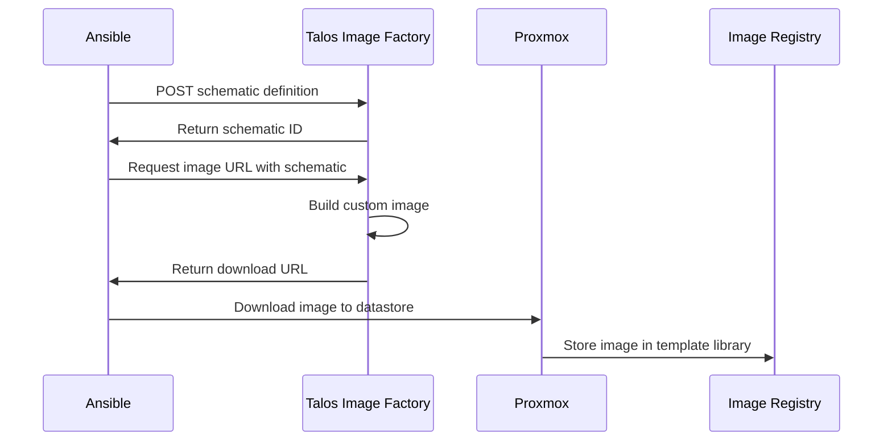
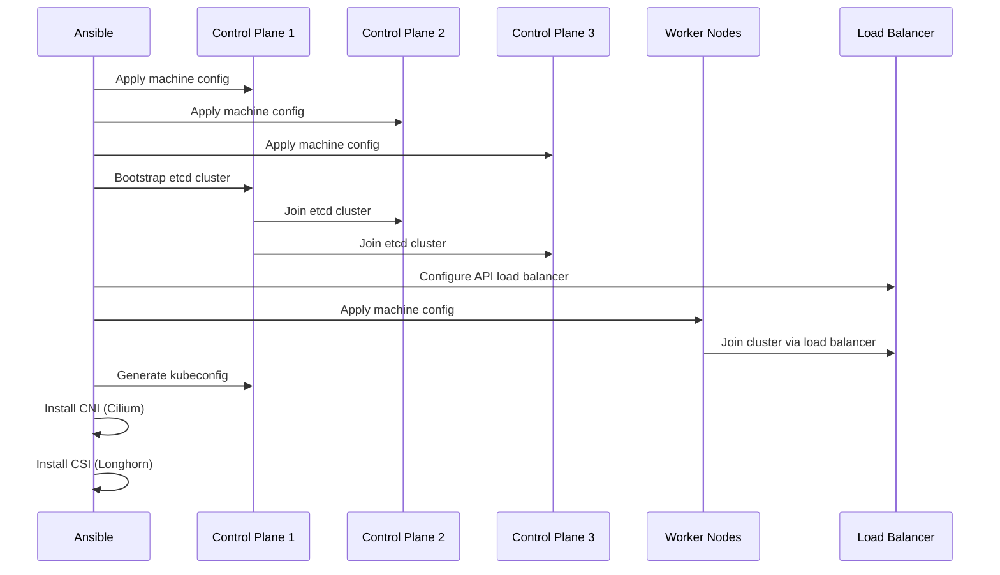

# InfraFlux v2.0 Talos Cluster Specification

## Overview

This document specifies the Talos Linux Kubernetes cluster configuration, deployment patterns, and operational procedures for InfraFlux v2.0. Talos Linux provides an immutable, secure, and API-driven foundation for Kubernetes clusters with minimal attack surface and declarative configuration.

## Talos Architecture Overview

### Talos Linux Core Principles

1. **Immutable Infrastructure**: Read-only root filesystem, no SSH access
2. **API-Driven Configuration**: All configuration via gRPC API
3. **Minimal Attack Surface**: Purpose-built OS with only essential components
4. **Secure by Default**: Built-in security features and best practices
5. **Declarative Configuration**: YAML-based machine and cluster configuration

### Talos Components



## Talos Version Strategy

### Supported Versions

| Talos Version | Kubernetes Version | Support Status | Deployment Target |
|---------------|-------------------|----------------|------------------|
| v1.6.x | 1.29.x | Current Stable | Production |
| v1.5.x | 1.28.x | Previous Stable | Legacy Support |
| v1.7.x-alpha | 1.30.x-rc | Development | Testing Only |

### Version Selection Strategy

```yaml
version_strategy:
  production_clusters:
    talos_version: "v1.6.0"  # Latest stable
    kubernetes_version: "v1.29.0"
    update_policy: "manual_approval_required"
    
  development_clusters:
    talos_version: "v1.6.0"  # Same as production for consistency
    kubernetes_version: "v1.29.0"
    update_policy: "automatic_patch_updates"
    
  testing_clusters:
    talos_version: "v1.7.0-alpha"  # Latest for feature testing
    kubernetes_version: "v1.30.0-rc"
    update_policy: "automatic_all_updates"
```

## Talos Image Management

### Custom Image Factory Configuration

#### Base Schematic Configuration
```yaml
# talos-schematic.yaml
customization:
  systemExtensions:
    officialExtensions:
      - siderolabs/i915-ucode      # Intel GPU drivers
      - siderolabs/intel-ucode     # Intel CPU microcode
      - siderolabs/qemu-guest-agent # VM guest agent
      - siderolabs/iscsi-tools     # iSCSI support
      - siderolabs/util-linux-tools # Additional utilities
```

#### Image Generation Workflow



#### Image Configuration Variables
```yaml
talos_image:
  version: "v1.6.0"
  platform: "nocloud"
  architecture: "amd64"
  factory_url: "https://factory.talos.dev"
  
  schematic:
    customization:
      systemExtensions:
        officialExtensions:
          - "siderolabs/qemu-guest-agent"
          - "siderolabs/intel-ucode"
          - "siderolabs/i915-ucode"
          
  image_naming:
    format: "talos-${version}-${platform}-${architecture}"
    example: "talos-v1.6.0-nocloud-amd64"
```

### Image Lifecycle Management

#### Image Update Strategy
```yaml
image_updates:
  security_patches:
    frequency: "immediate"
    approval: "automatic"
    rollback: "automatic_on_failure"
    
  feature_updates:
    frequency: "monthly"
    approval: "manual_review"
    rollback: "manual_decision"
    
  major_versions:
    frequency: "quarterly"
    approval: "extensive_testing_required"
    rollback: "full_backup_required"
```

## Cluster Configuration

### Machine Configuration Structure

#### Control Plane Configuration
```yaml
# controlplane.yaml
version: v1alpha1
debug: false
persist: true
machine:
  type: controlplane
  token: ${MACHINE_TOKEN}
  ca:
    crt: ${CA_CERTIFICATE}
    key: ${CA_PRIVATE_KEY}
  certSANs:
    - ${CLUSTER_ENDPOINT}
    - ${LOAD_BALANCER_IP}
  kubelet:
    image: registry.k8s.io/pause:3.8
    extraArgs:
      rotate-server-certificates: true
    nodeIP:
      validSubnets:
        - ${NODE_SUBNET}
  network:
    hostname: ${NODE_HOSTNAME}
    interfaces:
      - interface: eth0
        dhcp: true
        vip:
          ip: ${VIP_IP}
  install:
    disk: /dev/vda
    image: factory.talos.dev/installer/${SCHEMATIC_ID}:${TALOS_VERSION}
    wipe: false
  features:
    rbac: true
    stableHostname: true
    apidCheckExtKeyUsage: true

cluster:
  id: ${CLUSTER_ID}
  secret: ${CLUSTER_SECRET}
  controlPlane:
    endpoint: https://${CLUSTER_ENDPOINT}:6443
  clusterName: ${CLUSTER_NAME}
  network:
    dnsDomain: cluster.local
    podSubnets:
      - 10.244.0.0/16
    serviceSubnets:
      - 10.96.0.0/12
    cni:
      name: none  # We'll install Cilium separately
  proxy:
    disabled: true  # Using Cilium for kube-proxy replacement
  apiServer:
    image: registry.k8s.io/kube-apiserver:${KUBERNETES_VERSION}
    extraArgs:
      feature-gates: MixedProtocolLBService=true,EphemeralContainers=true
    auditPolicy:
      apiVersion: audit.k8s.io/v1
      kind: Policy
      rules:
        - level: Metadata
  controllerManager:
    image: registry.k8s.io/kube-controller-manager:${KUBERNETES_VERSION}
    extraArgs:
      feature-gates: MixedProtocolLBService=true
  scheduler:
    image: registry.k8s.io/kube-scheduler:${KUBERNETES_VERSION}
  etcd:
    image: gcr.io/etcd-development/etcd:v3.5.10
    extraArgs:
      listen-metrics-urls: http://0.0.0.0:2381
```

#### Worker Node Configuration
```yaml
# worker.yaml
version: v1alpha1
debug: false
persist: true
machine:
  type: worker
  token: ${MACHINE_TOKEN}
  ca:
    crt: ${CA_CERTIFICATE}
  kubelet:
    image: registry.k8s.io/pause:3.8
    extraArgs:
      rotate-server-certificates: true
    nodeIP:
      validSubnets:
        - ${NODE_SUBNET}
  network:
    hostname: ${NODE_HOSTNAME}
    interfaces:
      - interface: eth0
        dhcp: true
  install:
    disk: /dev/vda
    image: factory.talos.dev/installer/${SCHEMATIC_ID}:${TALOS_VERSION}
    wipe: false
  features:
    rbac: true
    stableHostname: true

cluster:
  id: ${CLUSTER_ID}
  secret: ${CLUSTER_SECRET}
  controlPlane:
    endpoint: https://${CLUSTER_ENDPOINT}:6443
  clusterName: ${CLUSTER_NAME}
  network:
    dnsDomain: cluster.local
    podSubnets:
      - 10.244.0.0/16
    serviceSubnets:
      - 10.96.0.0/12
    cni:
      name: none
  proxy:
    disabled: true
```

### Cluster Topology Patterns

#### Single Control Plane (Development)
```yaml
cluster_topology:
  control_plane:
    count: 1
    resources:
      cpu: 4
      memory: 8Gi
      disk: 50Gi
    high_availability: false
    
  workers:
    count: 2
    resources:
      cpu: 4
      memory: 8Gi
      disk: 50Gi
    auto_scaling: false
```

#### High Availability (Production)
```yaml
cluster_topology:
  control_plane:
    count: 3
    resources:
      cpu: 8
      memory: 16Gi
      disk: 100Gi
    distribution: across_availability_zones
    
  workers:
    count: 6
    resources:
      cpu: 16
      memory: 32Gi
      disk: 200Gi
    auto_scaling: true
    min_nodes: 3
    max_nodes: 20
```

## Bootstrap Process

### Cluster Initialization Workflow



### Bootstrap Commands

#### Control Plane Bootstrap
```bash
# Generate machine configurations
talosctl gen config ${CLUSTER_NAME} https://${CLUSTER_ENDPOINT}:6443 \
  --config-patch @controlplane-patch.yaml \
  --config-patch-control-plane @cp-patch.yaml

# Apply configuration to first control plane node
talosctl apply-config --insecure \
  --nodes ${CP1_IP} \
  --file controlplane.yaml

# Bootstrap etcd cluster
talosctl bootstrap --nodes ${CP1_IP}

# Wait for cluster to be ready
talosctl health --nodes ${CP1_IP}

# Get kubeconfig
talosctl kubeconfig --nodes ${CP1_IP}
```

#### Additional Control Plane Nodes
```bash
# Apply configuration to additional control plane nodes
talosctl apply-config --insecure \
  --nodes ${CP2_IP} \
  --file controlplane.yaml

talosctl apply-config --insecure \
  --nodes ${CP3_IP} \
  --file controlplane.yaml

# Wait for nodes to join
kubectl get nodes
```

#### Worker Node Join
```bash
# Apply worker configuration
talosctl apply-config --insecure \
  --nodes ${WORKER_IP} \
  --file worker.yaml

# Verify node joined
kubectl get nodes
```

## Networking Configuration

### Cilium CNI Integration

#### Cilium Configuration
```yaml
# cilium-values.yaml
cluster:
  name: ${CLUSTER_NAME}
  id: ${CLUSTER_ID}

kubeProxyReplacement: strict

operator:
  replicas: 2

ipam:
  mode: kubernetes

hubble:
  enabled: true
  relay:
    enabled: true
  ui:
    enabled: true

encryption:
  enabled: true
  type: wireguard

loadBalancer:
  mode: dsr

nodePort:
  enabled: true

hostServices:
  enabled: true

externalIPs:
  enabled: true

hostPort:
  enabled: true

image:
  pullPolicy: IfNotPresent

tunnel: disabled  # Use native routing
autoDirectNodeRoutes: true

ipv4NativeRoutingCIDR: ${NODE_CIDR}
```

#### Network Policy Configuration
```yaml
# Default deny-all network policy
apiVersion: networking.k8s.io/v1
kind: NetworkPolicy
metadata:
  name: default-deny-all
  namespace: default
spec:
  podSelector: {}
  policyTypes:
  - Ingress
  - Egress

---
# Allow kube-system traffic
apiVersion: networking.k8s.io/v1
kind: NetworkPolicy
metadata:
  name: allow-kube-system
  namespace: kube-system
spec:
  podSelector: {}
  policyTypes:
  - Ingress
  - Egress
  ingress:
  - {}
  egress:
  - {}
```

### Load Balancer Configuration

#### External Load Balancer (HAProxy)
```haproxy
# /etc/haproxy/haproxy.cfg
global
    log stdout local0
    daemon

defaults
    mode http
    timeout connect 5000ms
    timeout client 50000ms
    timeout server 50000ms

frontend kubernetes_api
    bind *:6443
    mode tcp
    option tcplog
    default_backend kubernetes_api_backend

backend kubernetes_api_backend
    mode tcp
    balance roundrobin
    option tcp-check
    server cp1 ${CP1_IP}:6443 check
    server cp2 ${CP2_IP}:6443 check
    server cp3 ${CP3_IP}:6443 check
```

## Storage Configuration

### Longhorn CSI Integration

#### Longhorn Configuration
```yaml
# longhorn-values.yaml
persistence:
  defaultClass: true
  defaultClassReplicaCount: 3
  reclaimPolicy: Retain

csi:
  kubeletRootDir: /var/lib/kubelet

defaultSettings:
  backupTarget: s3://longhorn-backups@us-east-1/
  backupTargetCredentialSecret: longhorn-backup-secret
  defaultReplicaCount: 3
  defaultDataPath: /var/lib/longhorn/
  replicaSoftAntiAffinity: true
  storageOverProvisioningPercentage: 100
  storageMinimalAvailablePercentage: 15

longhornManager:
  tolerations:
  - key: CriticalAddonsOnly
    operator: Exists
  - effect: NoSchedule
    key: node-role.kubernetes.io/control-plane
    operator: Exists

longhornDriver:
  tolerations:
  - key: CriticalAddonsOnly
    operator: Exists
  - effect: NoSchedule
    key: node-role.kubernetes.io/control-plane
    operator: Exists
```

#### Storage Classes
```yaml
# Fast storage class for databases
apiVersion: storage.k8s.io/v1
kind: StorageClass
metadata:
  name: longhorn-fast
provisioner: driver.longhorn.io
allowVolumeExpansion: true
parameters:
  numberOfReplicas: "2"
  staleReplicaTimeout: "30"
  diskSelector: "nvme"
  nodeSelector: "storage=fast"

---
# Standard storage class for general workloads
apiVersion: storage.k8s.io/v1
kind: StorageClass
metadata:
  name: longhorn-standard
  annotations:
    storageclass.kubernetes.io/is-default-class: "true"
provisioner: driver.longhorn.io
allowVolumeExpansion: true
parameters:
  numberOfReplicas: "3"
  staleReplicaTimeout: "60"

---
# Backup storage class for backups and archives
apiVersion: storage.k8s.io/v1
kind: StorageClass
metadata:
  name: longhorn-backup
provisioner: driver.longhorn.io
allowVolumeExpansion: true
parameters:
  numberOfReplicas: "2"
  staleReplicaTimeout: "300"
  recurringJobSelector: '[{"name":"backup", "isGroup":false}]'
```

## Security Configuration

### RBAC and Security Policies

#### Pod Security Standards
```yaml
# Pod Security Standards configuration
apiVersion: v1
kind: Namespace
metadata:
  name: production
  labels:
    pod-security.kubernetes.io/enforce: restricted
    pod-security.kubernetes.io/audit: restricted
    pod-security.kubernetes.io/warn: restricted
    
---
apiVersion: v1
kind: Namespace
metadata:
  name: development
  labels:
    pod-security.kubernetes.io/enforce: baseline
    pod-security.kubernetes.io/audit: baseline
    pod-security.kubernetes.io/warn: baseline
```

#### Network Policies
```yaml
# Ingress controller network policy
apiVersion: networking.k8s.io/v1
kind: NetworkPolicy
metadata:
  name: ingress-nginx
  namespace: ingress-nginx
spec:
  podSelector:
    matchLabels:
      app.kubernetes.io/name: ingress-nginx
  policyTypes:
  - Ingress
  - Egress
  ingress:
  - ports:
    - protocol: TCP
      port: 80
    - protocol: TCP
      port: 443
  egress:
  - {}
```

### Certificate Management

#### cert-manager Configuration
```yaml
# cert-manager ClusterIssuer
apiVersion: cert-manager.io/v1
kind: ClusterIssuer
metadata:
  name: letsencrypt-prod
spec:
  acme:
    server: https://acme-v02.api.letsencrypt.org/directory
    email: admin@example.com
    privateKeySecretRef:
      name: letsencrypt-prod
    solvers:
    - http01:
        ingress:
          class: nginx
```

## Monitoring and Observability

### Talos-Specific Monitoring

#### Talos Metrics Endpoints
```yaml
talos_metrics:
  endpoints:
    - name: "machine-api"
      port: 50000
      path: "/metrics"
      
    - name: "kubelet"
      port: 10250
      path: "/metrics"
      
    - name: "etcd"
      port: 2381
      path: "/metrics"
```

#### Prometheus ServiceMonitor
```yaml
apiVersion: monitoring.coreos.com/v1
kind: ServiceMonitor
metadata:
  name: talos-metrics
  namespace: monitoring
spec:
  selector:
    matchLabels:
      app: talos-exporter
  endpoints:
  - port: metrics
    interval: 30s
    path: /metrics
```

### Logging Configuration

#### Talos Log Collection
```yaml
# Vector log collection configuration
apiVersion: v1
kind: ConfigMap
metadata:
  name: vector-config
  namespace: logging
data:
  vector.toml: |
    [sources.talos_logs]
    type = "kubernetes_logs"
    namespace_annotation_fields.namespace = "kubernetes.namespace"
    node_annotation_fields.node = "kubernetes.node"
    pod_annotation_fields.pod = "kubernetes.pod"
    
    [transforms.talos_parser]
    type = "remap"
    inputs = ["talos_logs"]
    source = '''
    if exists(.kubernetes.container_name) && .kubernetes.container_name == "talos" {
      .service = "talos"
      .level = parse_regex(.message, r'\[(?P<level>\w+)\]') ?? "info"
    }
    '''
    
    [sinks.loki]
    type = "loki"
    inputs = ["talos_parser"]
    endpoint = "http://loki:3100"
    encoding.codec = "json"
```

## Upgrade Procedures

### Talos Upgrade Strategy

#### Rolling Upgrade Process
```bash
# 1. Upgrade Talos on control plane nodes one by one
talosctl upgrade --nodes ${CP1_IP} \
  --image factory.talos.dev/installer/${NEW_SCHEMATIC_ID}:${NEW_VERSION}

# Wait for node to be ready
kubectl wait --for=condition=Ready node/${CP1_HOSTNAME} --timeout=300s

# 2. Repeat for remaining control plane nodes
talosctl upgrade --nodes ${CP2_IP} \
  --image factory.talos.dev/installer/${NEW_SCHEMATIC_ID}:${NEW_VERSION}

talosctl upgrade --nodes ${CP3_IP} \
  --image factory.talos.dev/installer/${NEW_SCHEMATIC_ID}:${NEW_VERSION}

# 3. Upgrade worker nodes
for worker in ${WORKER_IPS}; do
  talosctl upgrade --nodes ${worker} \
    --image factory.talos.dev/installer/${NEW_SCHEMATIC_ID}:${NEW_VERSION}
  kubectl wait --for=condition=Ready node/${worker} --timeout=300s
done
```

#### Kubernetes Upgrade Process
```bash
# 1. Upgrade control plane
talosctl upgrade-k8s --nodes ${CP_IPS} --to ${NEW_K8S_VERSION}

# 2. Wait for control plane to be ready
kubectl get nodes

# 3. Upgrade worker nodes
talosctl upgrade-k8s --nodes ${WORKER_IPS} --to ${NEW_K8S_VERSION}
```

### Rollback Procedures

#### Emergency Rollback
```bash
# Rollback to previous Talos version
talosctl rollback --nodes ${NODE_IP}

# Rollback Kubernetes version
talosctl upgrade-k8s --nodes ${NODE_IP} --to ${PREVIOUS_K8S_VERSION}
```

## Disaster Recovery

### Backup Strategy

#### etcd Backup
```yaml
apiVersion: batch/v1
kind: CronJob
metadata:
  name: etcd-backup
  namespace: kube-system
spec:
  schedule: "0 */6 * * *"  # Every 6 hours
  jobTemplate:
    spec:
      template:
        spec:
          containers:
          - name: etcd-backup
            image: k8s.gcr.io/etcd:3.5.10
            command:
            - /bin/sh
            - -c
            - |
              ETCDCTL_API=3 etcdctl \
                --endpoints=https://127.0.0.1:2379 \
                --cacert=/etc/kubernetes/pki/etcd/ca.crt \
                --cert=/etc/kubernetes/pki/etcd/peer.crt \
                --key=/etc/kubernetes/pki/etcd/peer.key \
                snapshot save /backup/etcd-$(date +%Y%m%d%H%M%S).db
            volumeMounts:
            - name: etcd-certs
              mountPath: /etc/kubernetes/pki/etcd
            - name: backup-storage
              mountPath: /backup
          restartPolicy: OnFailure
          volumes:
          - name: etcd-certs
            hostPath:
              path: /etc/kubernetes/pki/etcd
          - name: backup-storage
            persistentVolumeClaim:
              claimName: etcd-backup-pvc
```

### Recovery Procedures

#### Full Cluster Recovery
1. **Restore etcd from backup**
2. **Rebuild control plane nodes**
3. **Rejoin worker nodes**
4. **Validate cluster functionality**
5. **Restore application data**

## Troubleshooting Guide

### Common Issues

#### Node Not Joining Cluster
```bash
# Check node status
talosctl health --nodes ${NODE_IP}

# Check machine config
talosctl get machineconfig --nodes ${NODE_IP}

# Check kubelet logs
talosctl logs kubelet --nodes ${NODE_IP}
```

#### Network Connectivity Issues
```bash
# Check Cilium status
cilium status

# Check network policies
kubectl get networkpolicies --all-namespaces

# Check Hubble for network flows
hubble observe --namespace default
```

#### Storage Issues
```bash
# Check Longhorn status
kubectl get pods -n longhorn-system

# Check volume status
kubectl get pv,pvc

# Check Longhorn manager logs
kubectl logs -n longhorn-system deployment/longhorn-manager
```

### Diagnostic Commands

#### Cluster Health Check
```bash
# Talos cluster health
talosctl health --nodes ${ALL_NODE_IPS}

# Kubernetes cluster health
kubectl get nodes
kubectl get pods --all-namespaces
kubectl top nodes

# Component status
kubectl get componentstatuses
```

#### Performance Diagnostics
```bash
# Node resource usage
kubectl top nodes

# Pod resource usage
kubectl top pods --all-namespaces

# Network performance
iperf3 -c ${TARGET_NODE}

# Storage performance
fio --name=random-read --rw=randread --size=1G --filename=/tmp/test
```

This specification provides a comprehensive foundation for deploying and managing Talos Linux Kubernetes clusters in the InfraFlux v2.0 project.