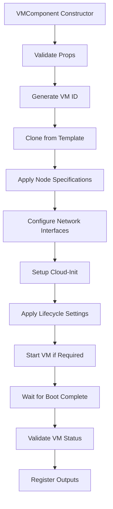

# VM Component Specification Document
**InfraFlux v2.0 - Task T3.1.4**

## Document Overview

**Version**: 1.0  
**Date**: 2025-06-20  
**Component**: VM Component (T3.1.4)  
**Dependencies**: VM Template Component (T3.1.3), Network Component (T3.1.2), Proxmox Provider (T3.1.1)  
**Estimated Duration**: 2.5 hours  

## Executive Summary

The VM Component is responsible for creating and managing individual virtual machines in InfraFlux v2.0. It provisions VMs from templates, applies node-specific configurations, manages lifecycle operations, and integrates with the network component for IP allocation. The component follows the Pulumi ComponentResource pattern and provides type-safe VM management with comprehensive error handling.

## Technical Architecture

### Component Design Pattern
```typescript
export class VMComponent extends pulumi.ComponentResource {
  public readonly vm: pulumi.Output<VMOutputExtended>;
  public readonly ipAddress: pulumi.Output<string>;
  public readonly ready: pulumi.Output<boolean>;
  public readonly status: pulumi.Output<VMStatus>;
  public readonly networkConfig: pulumi.Output<VMNetworkConfiguration>;
}
```

### Dependencies
1. **VM Template Component** (T3.1.3): Provides base templates for cloning
2. **Network Component** (T3.1.2): Supplies IP allocation and VLAN configuration
3. **Proxmox Provider** (T3.1.1): Handles Proxmox API authentication and connection

### Core Responsibilities
1. **VM Provisioning**: Clone VMs from templates with node specifications
2. **Configuration Management**: Apply CPU, memory, disk, and network settings
3. **Cloud-Init Integration**: Setup user accounts, SSH keys, and initial configuration
4. **Network Configuration**: Connect VMs to appropriate bridges and VLANs
5. **Lifecycle Management**: Handle start/stop/restart operations and status monitoring
6. **Resource Allocation**: Ensure optimal placement across Proxmox nodes

## API Specification

### Input Interface
```typescript
export interface VMComponentProps extends ComponentProps {
  /** Node configuration from cluster definition */
  nodeConfig: NodeConfig;
  
  /** Proxmox provider instance */
  proxmoxProvider: proxmoxve.Provider;
  
  /** Target Proxmox node for VM placement */
  proxmoxNode: string;
  
  /** VM template to clone from */
  template: VMTemplateComponent | string;
  
  /** Network component for IP allocation */
  networkComponent?: NetworkComponent;
  
  /** Cloud-init configuration */
  cloudInit?: CloudInitConfig;
  
  /** VM lifecycle options */
  lifecycle?: VMLifecycleOptions;
  
  /** Clone options */
  cloneOptions?: CloneOptions;
  
  /** Resource optimization settings */
  optimization?: VMOptimizationConfig;
  
  /** Monitoring configuration */
  monitoring?: VMMonitoringConfig;
}
```

### Output Interface
```typescript
export interface VMOutputExtended extends VMOutput {
  /** Clone source information */
  cloneSource?: {
    templateId: number;
    templateName: string;
    cloneType: 'full' | 'linked';
  };
  
  /** Network configuration details */
  networkDetails?: {
    interfaces: Array<{
      name: string;
      mac: string;
      bridge: string;
      vlan?: number;
      ip?: string;
      gateway?: string;
    }>;
  };
  
  /** Cloud-init status */
  cloudInitStatus?: {
    ready: boolean;
    userData: boolean;
    networkConfig: boolean;
  };
  
  /** Resource utilization */
  resources?: {
    cpuUsage?: number;
    memoryUsage?: number;
    diskUsage?: number;
  };
}
```

### Configuration Schemas

#### Cloud-Init Configuration
```typescript
export interface CloudInitConfig {
  /** User data (cloud-config format) */
  userData?: string;
  
  /** Network configuration */
  networkConfig?: string;
  
  /** SSH public keys for default user */
  sshKeys?: string[];
  
  /** Default user configuration */
  user?: {
    name: string;
    password?: string;
    sudo?: boolean;
  };
  
  /** Packages to install on first boot */
  packages?: string[];
  
  /** Commands to run on first boot */
  runCmd?: string[];
  
  /** Files to write on first boot */
  writeFiles?: Array<{
    path: string;
    content: string;
    permissions?: string;
    owner?: string;
  }>;
}
```

#### VM Lifecycle Options
```typescript
export interface VMLifecycleOptions {
  /** Start VM on Proxmox node boot */
  onBoot?: boolean;
  
  /** Start VM after creation */
  startAfterCreate?: boolean;
  
  /** Protection from accidental deletion */
  protection?: boolean;
  
  /** VM startup order and delays */
  startup?: {
    order?: number;
    up?: number;
    down?: number;
  };
  
  /** Automatic restart on failure */
  autoRestart?: boolean;
  
  /** VM shutdown timeout in seconds */
  shutdownTimeout?: number;
}
```

#### Resource Optimization
```typescript
export interface VMOptimizationConfig {
  /** CPU topology optimization */
  cpuTopology?: {
    numa?: boolean;
    cpuUnits?: number;
    cpuLimit?: number;
  };
  
  /** Memory optimization */
  memory?: {
    ballooning?: boolean;
    hugepages?: boolean;
    swappiness?: number;
  };
  
  /** Disk optimization */
  disk?: {
    cache?: 'none' | 'writethrough' | 'writeback';
    ioThread?: boolean;
    backup?: boolean;
    discard?: boolean;
  };
  
  /** Network optimization */
  network?: {
    multiqueue?: boolean;
    packetBuffer?: number;
    rateLimiting?: {
      mbps?: number;
    };
  };
}
```

## Implementation Flow

### VM Creation Workflow


### Configuration Processing
1. **Template Resolution**: Resolve template component or string reference
2. **Resource Calculation**: Apply node specifications (CPU, memory, disk)
3. **Network Configuration**: Connect to bridges, assign VLANs, allocate IPs
4. **Cloud-Init Generation**: Create user data and network configuration
5. **Lifecycle Application**: Set startup options and protection settings

## Task Breakdown

### T3.1.4.1: VM Configuration Schema Enhancement (20 min)
**Priority**: P0 - Critical Path  
**Dependencies**: None  

#### Subtasks:
1. **T3.1.4.1.1**: Update VMComponentProps interface (5 min)
   - Add template parameter (VMTemplateComponent | string)
   - Add networkComponent parameter
   - Add cloudInit, lifecycle, cloneOptions parameters
   - Add optimization and monitoring configurations

2. **T3.1.4.1.2**: Create CloudInitConfig interface (5 min)
   - Support user data, network config, SSH keys
   - Include user account configuration
   - Add package installation and command execution
   - Define file writing capabilities

3. **T3.1.4.1.3**: Create VMLifecycleOptions interface (5 min)
   - Boot configuration options
   - Startup order and delays
   - Protection and restart settings
   - Shutdown timeout configuration

4. **T3.1.4.1.4**: Create VMOptimizationConfig interface (5 min)
   - CPU topology and NUMA settings
   - Memory ballooning and hugepages
   - Disk cache and I/O optimization
   - Network multiqueue and rate limiting

**Acceptance Criteria**:
- All interfaces properly typed with TypeScript strict mode
- Comprehensive JSDoc documentation for all properties
- Optional parameters have sensible defaults
- Interfaces support both simple and advanced configurations

### T3.1.4.2: Template Resolution and VM Cloning (45 min)
**Priority**: P0 - Critical Path  
**Dependencies**: T3.1.4.1  

#### Subtasks:
1. **T3.1.4.2.1**: Template reference resolution (15 min)
   - Support VMTemplateComponent object references
   - Support string template names with lookup
   - Validate template exists and is ready
   - Extract template ID and metadata

2. **T3.1.4.2.2**: VM ID generation and uniqueness (10 min)
   - Generate unique VM ID for new VMs
   - Check ID conflicts across Proxmox cluster
   - Support manual ID specification
   - Implement retry logic for ID conflicts

3. **T3.1.4.2.3**: VM cloning implementation (20 min)
   - Use proxmoxve.vm.VirtualMachine with clone parameter
   - Support full and linked clones
   - Handle cross-node cloning
   - Apply target storage configuration

**Acceptance Criteria**:
- Templates resolved correctly from both component and string references
- VM IDs are unique across the cluster
- Cloning works for both full and linked clones
- Cross-node cloning supported
- Error handling for template not found or not ready

**Implementation Pattern**:
```typescript
private resolveTemplate(template: VMTemplateComponent | string): pulumi.Output<TemplateInfo> {
  if (typeof template === 'string') {
    // Lookup template by name
    return this.lookupTemplateByName(template);
  } else {
    // Use component reference
    return template.getTemplateInfo();
  }
}
```

### T3.1.4.3: Resource Specification Application (35 min)
**Priority**: P0 - Critical Path  
**Dependencies**: T3.1.4.2  

#### Subtasks:
1. **T3.1.4.3.1**: CPU configuration (10 min)
   - Apply cores and sockets from NodeConfig
   - Configure CPU type and features
   - Set CPU units and limits
   - Apply NUMA topology if enabled

2. **T3.1.4.3.2**: Memory configuration (10 min)
   - Set dedicated memory from NodeConfig
   - Configure memory ballooning if enabled
   - Apply hugepages configuration
   - Set memory limits and reservations

3. **T3.1.4.3.3**: Disk configuration (15 min)
   - Create disks based on NodeConfig.specs.disk
   - Apply disk format, cache, and I/O settings
   - Configure backup and replication settings
   - Set disk size and storage location

**Acceptance Criteria**:
- CPU configuration matches NodeConfig specifications
- Memory settings applied correctly with optimization
- Disk configuration supports multiple disks per VM
- All resource limits and optimization settings applied
- Validation prevents over-allocation of node resources

**Implementation Pattern**:
```typescript
private applyCPUConfig(nodeSpecs: NodeSpecs, optimization?: VMOptimizationConfig): CPUConfig {
  return {
    cores: nodeSpecs.cores,
    sockets: 1,
    type: 'host',
    units: optimization?.cpuTopology?.cpuUnits || 1024,
    numa: optimization?.cpuTopology?.numa || false,
  };
}
```

### T3.1.4.4: Network Interface Configuration (40 min)
**Priority**: P1 - High Priority  
**Dependencies**: T3.1.4.3, Network Component  

#### Subtasks:
1. **T3.1.4.4.1**: Network interface creation (15 min)
   - Create network devices based on NodeConfig.specs.network
   - Apply bridge and VLAN configuration
   - Set network adapter model (virtio)
   - Configure MAC address handling

2. **T3.1.4.4.2**: IP allocation integration (15 min)
   - Integrate with NetworkComponent for IP allocation
   - Support both DHCP and static IP assignment
   - Handle IP allocation failures gracefully
   - Update network configuration in VM

3. **T3.1.4.4.3**: Advanced network features (10 min)
   - Configure network firewall if enabled
   - Apply traffic shaping and rate limiting
   - Set up multiqueue networking
   - Configure VLAN tags and priorities

**Acceptance Criteria**:
- Network interfaces created according to NodeConfig
- IP allocation integrated with NetworkComponent
- Support for both DHCP and static IP configuration
- VLAN tagging and bridge association working
- Network optimization features configurable

**Implementation Pattern**:
```typescript
private createNetworkDevices(networkSpecs: NetworkInterface[], networkComponent?: NetworkComponent): NetworkDevice[] {
  return networkSpecs.map((spec, index) => ({
    bridge: spec.bridge,
    model: 'virtio',
    tag: spec.vlan,
    ...(spec.dhcp ? {} : { 
      firewall: true,
      // Static IP via cloud-init
    }),
  }));
}
```

### T3.1.4.5: Cloud-Init Integration (30 min)
**Priority**: P1 - High Priority  
**Dependencies**: T3.1.4.4  

#### Subtasks:
1. **T3.1.4.5.1**: User data generation (15 min)
   - Generate cloud-config YAML
   - Include SSH keys and user accounts
   - Add package installation lists
   - Configure system settings and services

2. **T3.1.4.5.2**: Network configuration generation (10 min)
   - Generate network configuration for static IPs
   - Configure DNS settings and domain
   - Set hostname and FQDN
   - Apply gateway and routing configuration

3. **T3.1.4.5.3**: Cloud-init integration with Proxmox (5 min)
   - Configure initialization parameter in VM
   - Set cloud-init drive and format
   - Apply user data and network config
   - Validate cloud-init execution

**Acceptance Criteria**:
- Cloud-config YAML generated correctly
- Network configuration supports static and DHCP
- SSH keys and user accounts configured properly
- Integration with Proxmox initialization works
- Cloud-init execution validated post-boot

**Implementation Pattern**:
```typescript
private generateCloudInit(config: CloudInitConfig, networkConfig: NetworkConfiguration): CloudInitData {
  const userData = {
    '#cloud-config': true,
    hostname: config.hostname,
    users: config.users,
    ssh_authorized_keys: config.sshKeys,
    packages: config.packages,
    runcmd: config.runCmd,
    write_files: config.writeFiles,
  };
  
  return {
    userData: YAML.stringify(userData),
    networkConfig: this.generateNetworkConfig(networkConfig),
  };
}
```

### T3.1.4.6: VM Lifecycle Management (25 min)
**Priority**: P1 - High Priority  
**Dependencies**: T3.1.4.5  

#### Subtasks:
1. **T3.1.4.6.1**: VM startup and boot management (10 min)
   - Configure VM boot order and settings
   - Implement startup delays and dependencies
   - Set auto-start on node boot
   - Handle VM start failures gracefully

2. **T3.1.4.6.2**: VM status monitoring (10 min)
   - Monitor VM status through Proxmox API
   - Track boot completion and readiness
   - Implement health checks via QEMU agent
   - Report VM resource utilization

3. **T3.1.4.6.3**: VM lifecycle operations (5 min)
   - Implement start/stop/restart operations
   - Configure protection settings
   - Handle graceful shutdowns
   - Support force stop operations

**Acceptance Criteria**:
- VM startup configured according to lifecycle options
- VM status accurately monitored and reported
- Lifecycle operations (start/stop/restart) working
- Protection settings prevent accidental operations
- Health checks validate VM readiness

### T3.1.4.7: Error Handling and Validation (15 min)
**Priority**: P1 - High Priority  
**Dependencies**: T3.1.4.6  

#### Subtasks:
1. **T3.1.4.7.1**: Input validation (5 min)
   - Validate NodeConfig specifications
   - Check resource availability on target node
   - Validate network configuration consistency
   - Ensure template compatibility

2. **T3.1.4.7.2**: Runtime error handling (5 min)
   - Handle VM creation failures
   - Manage IP allocation conflicts
   - Deal with resource exhaustion errors
   - Implement retry logic for transient failures

3. **T3.1.4.7.3**: State consistency validation (5 min)
   - Verify VM state after operations
   - Validate network connectivity
   - Check cloud-init execution success
   - Ensure resource allocation matches specifications

**Acceptance Criteria**:
- Comprehensive input validation with clear error messages
- Graceful handling of creation and runtime errors
- State consistency verified after all operations
- Detailed error reporting for troubleshooting

## Testing Strategy

### Unit Tests
1. **Template Resolution Tests**
   - Test both component and string template references
   - Validate template lookup by name
   - Test error handling for missing templates

2. **Configuration Tests**
   - Test CPU, memory, disk configuration application
   - Validate network interface creation
   - Test cloud-init generation

3. **Lifecycle Tests**
   - Test VM startup and shutdown operations
   - Validate status monitoring
   - Test protection and restart settings

### Integration Tests
1. **End-to-End VM Creation**
   - Test complete VM creation workflow
   - Validate integration with Template and Network components
   - Test with both DHCP and static IP configuration

2. **Network Integration**
   - Test VLAN tagging and bridge association
   - Validate IP allocation and release
   - Test network connectivity

3. **Template Integration**
   - Test cloning from various template types
   - Validate template readiness checks
   - Test cross-node template cloning

### Property-Based Tests
1. **Resource Allocation**
   - Test with random valid resource specifications
   - Validate resource limits and constraints
   - Test optimization setting combinations

2. **Network Configuration**
   - Test with various network topologies
   - Validate IP allocation across different subnets
   - Test VLAN configuration combinations

## Performance Requirements

### Resource Allocation
- **CPU**: Support 1-64 cores per VM
- **Memory**: Support 512MB-256GB RAM per VM
- **Disk**: Support multiple disks up to 8TB each
- **Network**: Support up to 8 network interfaces per VM

### Performance Targets
- **VM Creation Time**: < 5 minutes for standard configuration
- **Boot Time**: < 3 minutes from template
- **Network Setup**: < 30 seconds for IP allocation
- **Status Monitoring**: Real-time status updates

### Scalability Limits
- **Concurrent VMs**: Support 100+ VMs per Proxmox node
- **Cluster Scale**: Support 1000+ VMs across cluster
- **Template Variants**: Support 50+ different templates
- **Network Segments**: Support 100+ VLANs

## Security Considerations

### Access Control
- VM creation requires proper Proxmox permissions
- Template access controlled by RBAC policies
- Network isolation enforced through VLANs
- SSH key management for secure access

### Data Protection
- Cloud-init user data encrypted in transit
- SSH private keys never stored in code
- VM disks encrypted at rest if configured
- Network traffic isolated by security groups

### Compliance
- Audit logging for all VM operations
- Configuration change tracking
- Resource usage monitoring
- Security policy enforcement

## Error Scenarios and Recovery

### Common Error Conditions
1. **Template Not Ready**: Wait and retry template resolution
2. **Resource Exhaustion**: Fail fast with clear error message
3. **Network Allocation Failure**: Release partial allocations and retry
4. **VM Creation Timeout**: Clean up partial resources
5. **Cloud-Init Failure**: Provide diagnostic information

### Recovery Strategies
1. **Automatic Retry**: Retry transient failures with exponential backoff
2. **Resource Cleanup**: Clean up partial allocations on failure
3. **State Reconciliation**: Verify and correct inconsistent state
4. **Manual Intervention**: Provide clear guidance for manual fixes

## Dependencies and Integration

### Internal Dependencies
- **VM Template Component**: Provides base templates for cloning
- **Network Component**: Supplies network configuration and IP allocation
- **Proxmox Provider**: Handles API authentication and resource management

### External Dependencies
- **Proxmox VE API**: VM creation and management
- **QEMU Guest Agent**: VM status monitoring and configuration
- **Cloud-Init**: VM initialization and configuration
- **Network Infrastructure**: Physical bridges and VLANs

### Integration Points
- **Pulumi State Management**: Resource state tracking
- **Logging System**: Comprehensive operation logging
- **Monitoring System**: VM health and performance metrics
- **GitOps System**: Configuration change tracking

## Success Criteria

### Functional Requirements
- [ ] VM creation from templates works reliably
- [ ] Network configuration and IP allocation functional
- [ ] Cloud-init setup configures VMs correctly
- [ ] Lifecycle operations (start/stop/restart) work
- [ ] Status monitoring provides accurate information

### Quality Requirements
- [ ] 95%+ success rate for VM creation
- [ ] < 5 minute average VM creation time
- [ ] Zero data corruption or resource leaks
- [ ] Comprehensive error handling and reporting
- [ ] Full test coverage (unit, integration, property-based)

### Documentation Requirements
- [ ] Complete API documentation with examples
- [ ] Configuration guide with best practices
- [ ] Troubleshooting guide for common issues
- [ ] Integration examples with other components
- [ ] Performance tuning recommendations

---

**Document Status**: Draft  
**Next Review**: After T3.1.4 implementation completion  
**Approval Required**: Technical lead review before implementation  